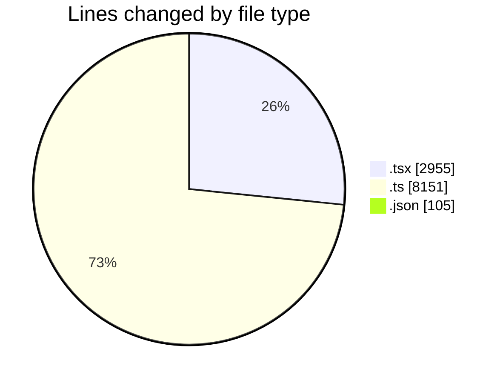
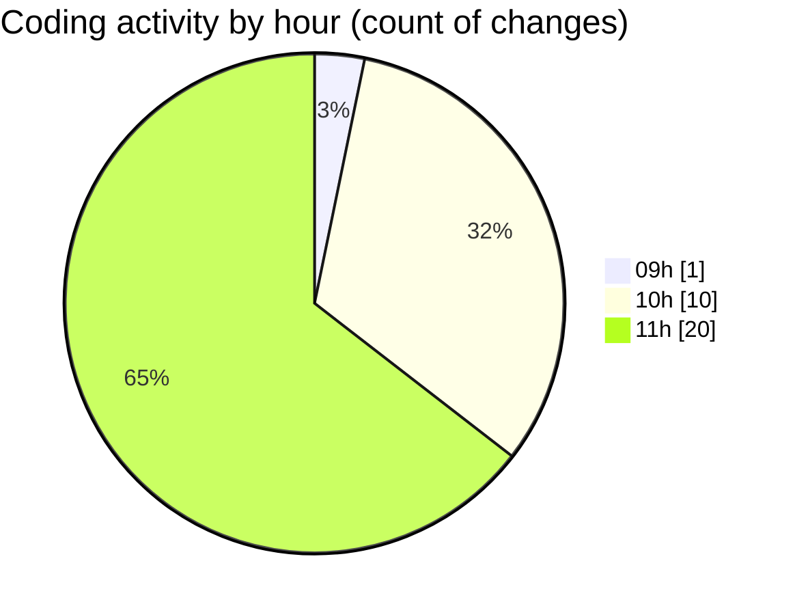

# cda - Activity Summary 

## Overall Statistics

| Stat                   | Value                                                             |
| ---------------------- | ----------------------------------------------------------------- |
| **Lines Added** (➕)   | 11141                                          |
| **Lines Removed** (➖) | 70                                        |
| **Net Change** (↕)    | 11071                |
| **Active Time** (⌚)   | 42 minutes |

## Modified Files
- **PoolPosition.tsx** (+617, -0)
- **AdminHelper.tsx** (+245, -18)
- **HelperSection.tsx** (+60, -0)
- **helperPanels.ts** (+356, -36)
- **ReinvestmentDetail.test.tsx** (+441, -0)
- **CreateInitiative.test.tsx** (+365, -0)
- **graphql.ts** (+7759, -0)
- **settings.json** (+105, -0)
- **RoleDetails.tsx** (+78, -0)
- **DetailsField.tsx** (+275, -14)
- **Filters.tsx** (+136, -0)
- **App.tsx** (+576, -0)
- **EditableTextInput.tsx** (+128, -2)

## Visualizations

### By File Type (Lines Changed)

### By Hour (Estimated Activity Count)

> **Last Updated:** 09/07/2025, 11:54:49