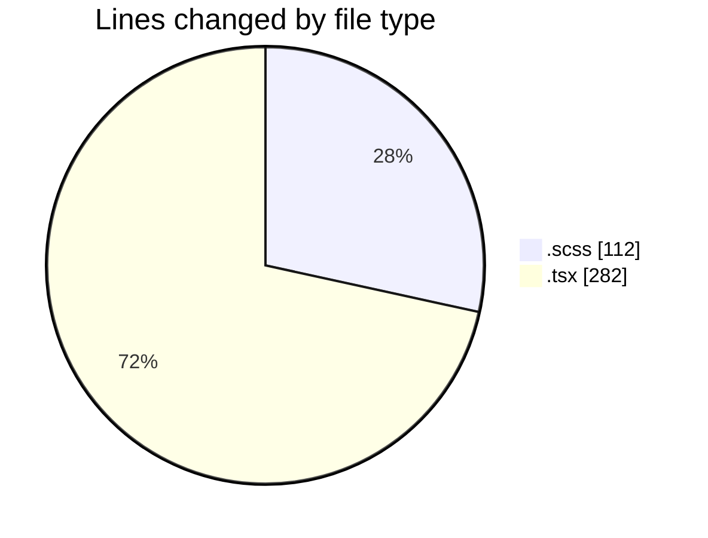
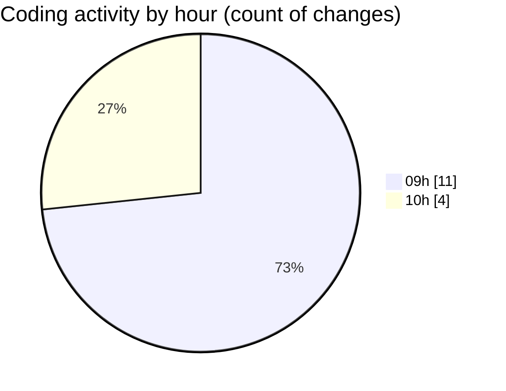

# cda - Activity Summary 

## Overall Statistics

| Stat                   | Value                                                             |
| ---------------------- | ----------------------------------------------------------------- |
| **Lines Added** (➕)   | 388                                          |
| **Lines Removed** (➖) | 6                                        |
| **Net Change** (↕)    | 382                |
| **Active Time** (⌚)   | 17 minutes |

## Modified Files
- **CommonTable.scss** (+99, -6)
- **InitiativeHeadcountForecastsTable.tsx** (+157, -0)
- **InitiativeHeadcountForecasts.tsx** (+125, -0)
- **InitiativeForecasts.scss** (+7, -0)

## Visualizations

### By File Type (Lines Changed)

### By Hour (Estimated Activity Count)

> **Last Updated:** 10/07/2025, 10:05:49