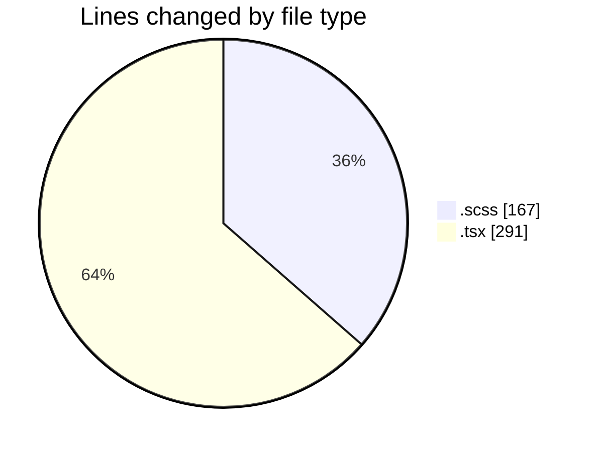
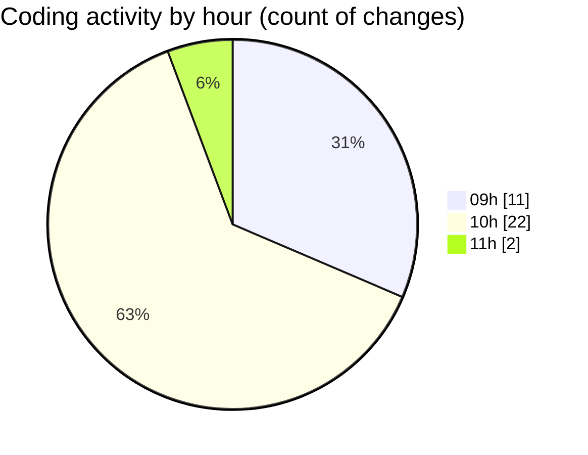

# cda - Activity Summary 

## Overall Statistics

| Stat                   | Value                                                             |
| ---------------------- | ----------------------------------------------------------------- |
| **Lines Added** (➕)   | 437                                          |
| **Lines Removed** (➖) | 21                                        |
| **Net Change** (↕)    | 416                |
| **Active Time** (⌚)   | 43 minutes |

## Modified Files
- **CommonTable.scss** (+100, -10)
- **InitiativeHeadcountForecastsTable.tsx** (+157, -0)
- **InitiativeHeadcountForecasts.tsx** (+127, -0)
- **InitiativeForecasts.scss** (+7, -1)
- **InitiativeDetails.scss** (+22, -6)
- **ddas.scss** (+7, -0)
- **InitiativeHeadcountForecasts.scss** (+11, -3)
- **Panel.tsx** (+2, -0)
- **EditableTextInput.tsx** (+3, -0)
- **App.tsx** (+1, -1)

## Visualizations

### By File Type (Lines Changed)

### By Hour (Estimated Activity Count)

> **Last Updated:** 10/07/2025, 11:10:49