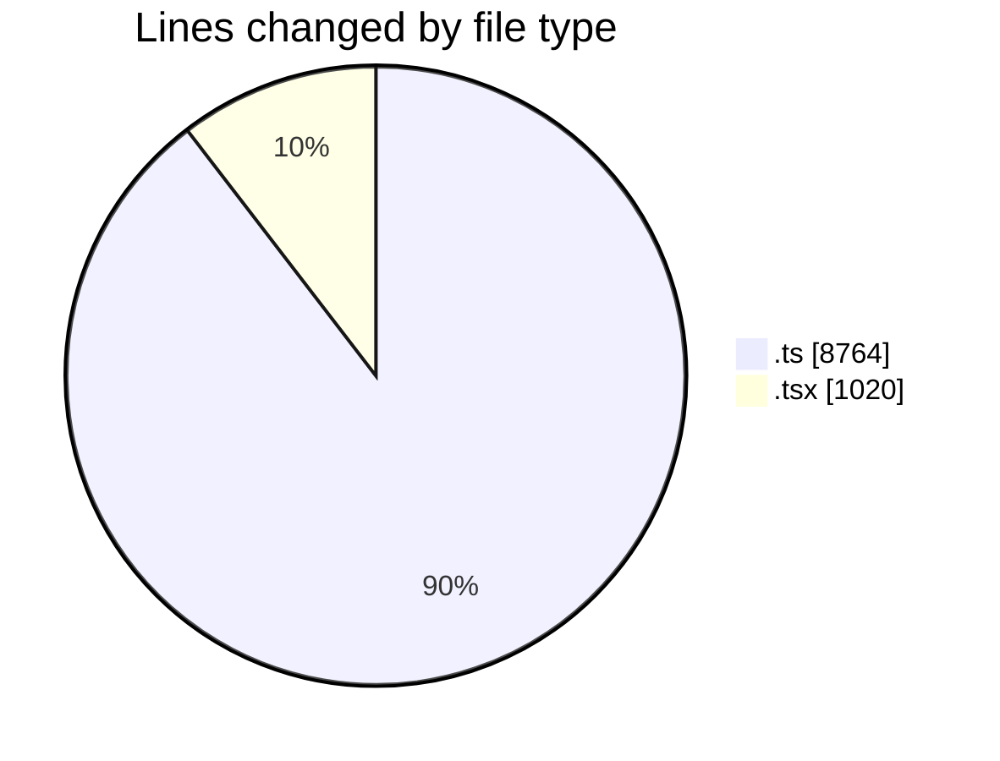
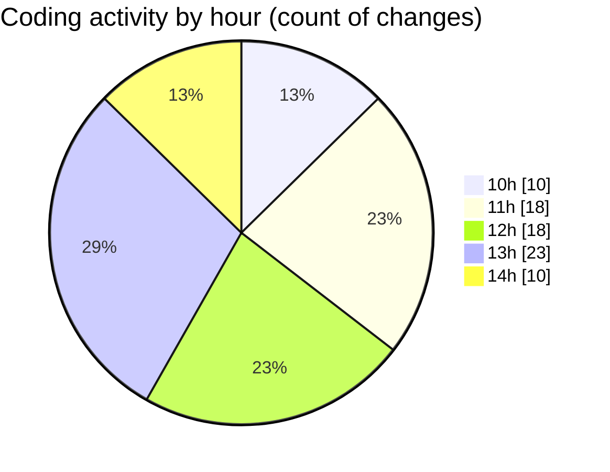

# cda - Activity Summary 

## Overall Statistics

| Stat                   | Value                                                             |
| ---------------------- | ----------------------------------------------------------------- |
| **Lines Added** (➕)   | 9596                                          |
| **Lines Removed** (➖) | 188                                        |
| **Net Change** (↕)    | 9408                |
| **Active Time** (⌚)   | 132 minutes |

## Modified Files
- **helperText.ts** (+31, -0)
- **AdminHelper.tsx** (+290, -37)
- **helperPanels.ts** (+578, -151)
- **types.ts** (+131, -0)
- **graphql.ts** (+7759, -0)
- **EditableTextInput.tsx** (+117, -0)
- **App.tsx** (+576, -0)
- **helperPanels.test.ts** (+114, -0)

## Visualizations

### By File Type (Lines Changed)

### By Hour (Estimated Activity Count)

> **Last Updated:** 14/07/2025, 14:10:46