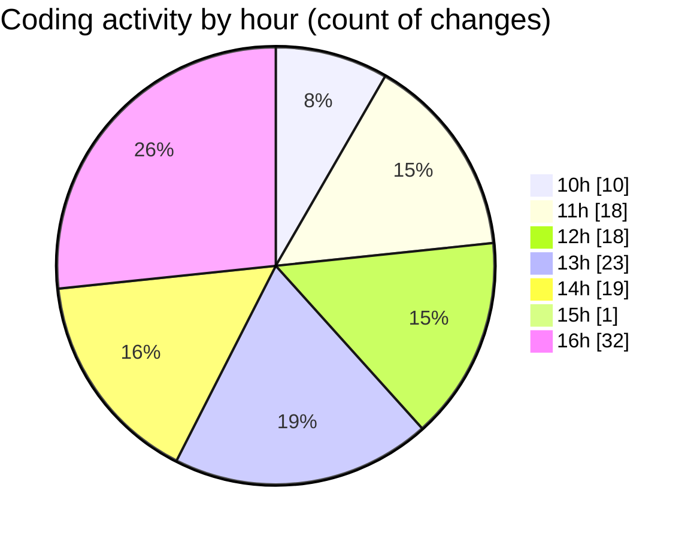

# cda - Activity Summary 

## Overall Statistics

| Stat                   | Value                                                             |
| ---------------------- | ----------------------------------------------------------------- |
| **Lines Added** (➕)   | 12155                                          |
| **Lines Removed** (➖) | 362                                        |
| **Net Change** (↕)    | 11793                |
| **Active Time** (⌚)   | 189 minutes |

## Modified Files
- **helperText.ts** (+31, -0)
- **AdminHelper.tsx** (+1062, -38)
- **helperPanels.ts** (+1941, -207)
- **types.ts** (+131, -0)
- **graphql.ts** (+7759, -0)
- **EditableTextInput.tsx** (+117, -0)
- **App.tsx** (+576, -0)
- **helperPanels.test.ts** (+339, -117)
- **EftTotals.tsx** (+112, -0)
- **settings.json** (+87, -0)

## Visualizations

### By File Type (Lines Changed)

### By Hour (Estimated Activity Count)

> **Last Updated:** 14/07/2025, 16:52:12