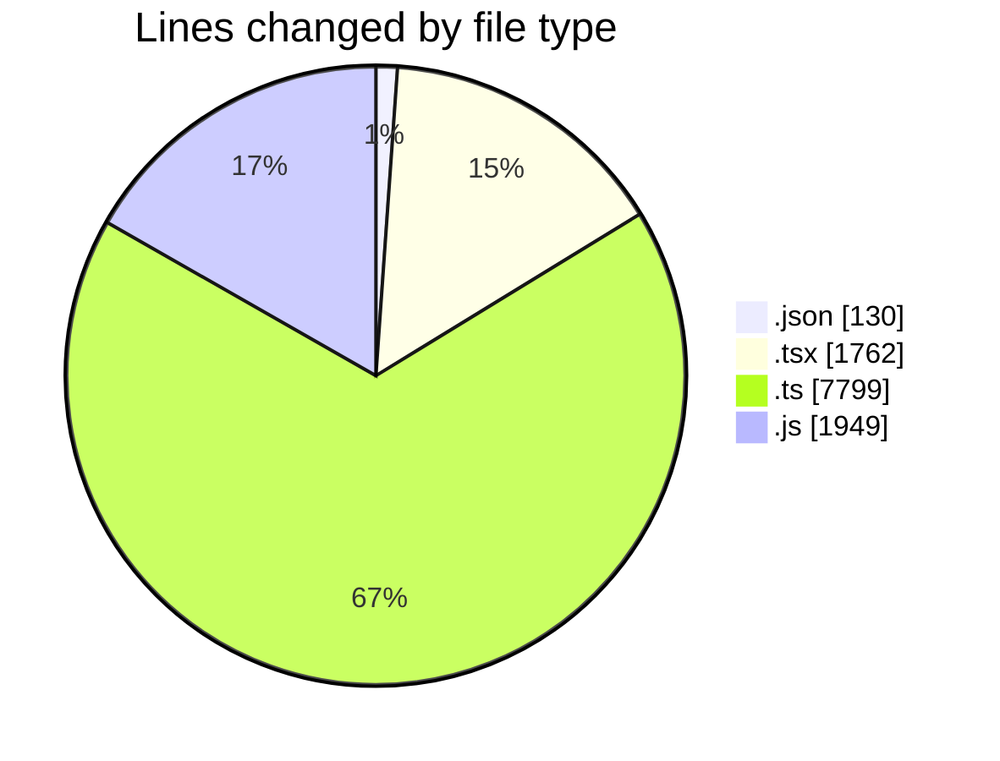
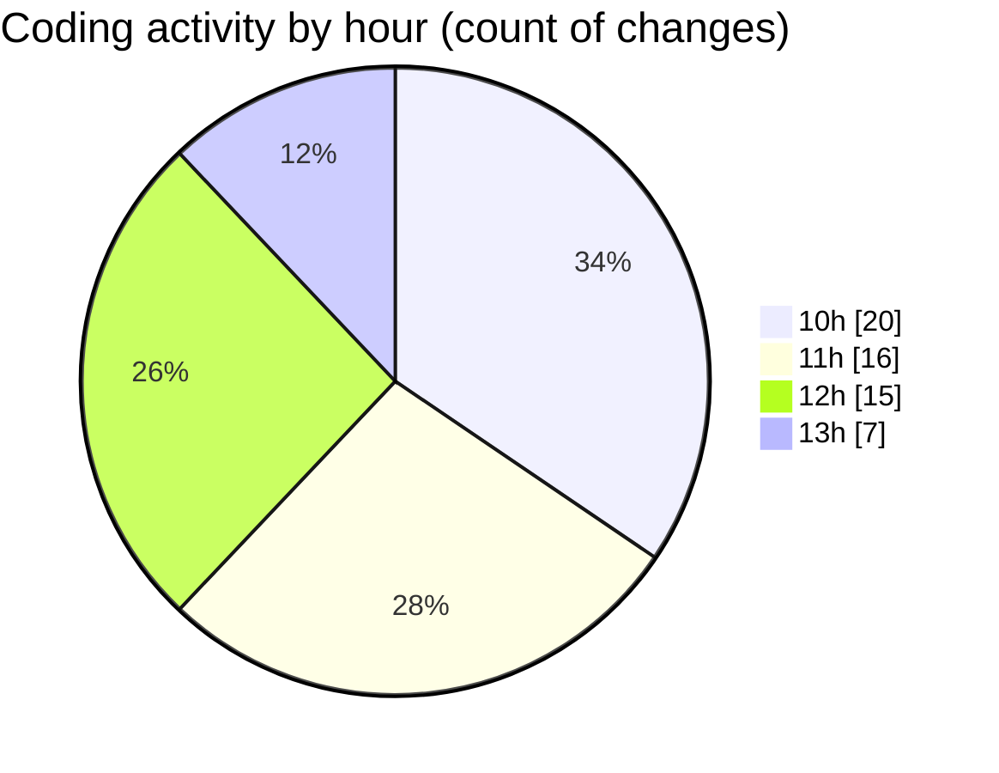

# cda - Activity Summary 

## Overall Statistics

| Stat                   | Value                                                             |
| ---------------------- | ----------------------------------------------------------------- |
| **Lines Added** (➕)   | 11621                                          |
| **Lines Removed** (➖) | 19                                        |
| **Net Change** (↕)    | 11602                |
| **Active Time** (⌚)   | 54 minutes |

## Modified Files
- **settings.json** (+124, -6)
- **App.tsx** (+1761, -1)
- **clear_view_views.ts** (+6642, -12)
- **20250724160129-create-initiative-comment.js** (+46, -0)
- **20250724163019-create-pool-position-comment.js** (+46, -0)
- **20250725105242-create-target-comment.js** (+23, -0)
- **20250724162756-create-pool-comment.js** (+23, -0)
- **20250724162644-create-reinvestment-comment.js** (+46, -0)
- **20250724161457-create-cost-comment.js** (+23, -0)
- **sap_views.ts** (+1145, -0)
- **clear-view-types.js** (+1234, -0)
- **clear-view-queries.js** (+508, -0)

## Visualizations

### By File Type (Lines Changed)

### By Hour (Estimated Activity Count)

> **Last Updated:** 28/07/2025, 13:28:55