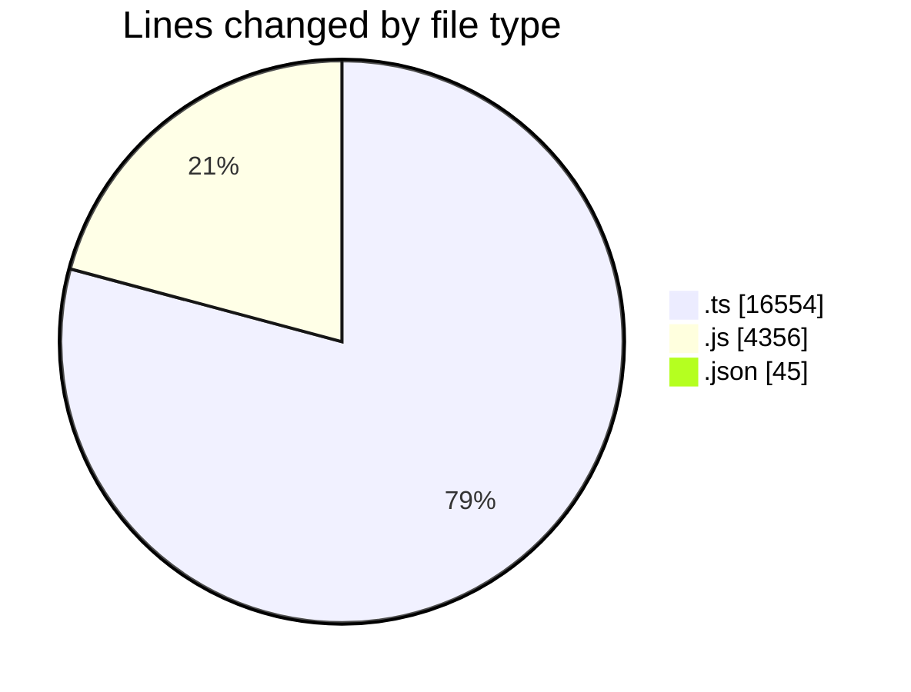
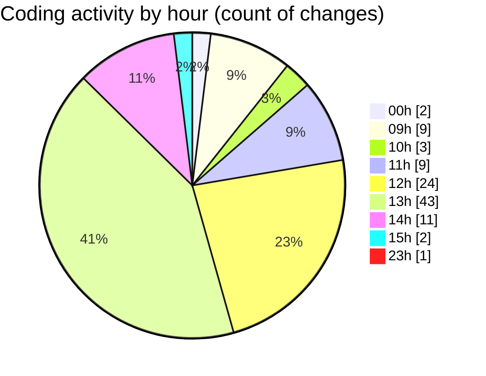

# cda - Activity Summary 

## Overall Statistics

| Stat                   | Value                                                             |
| ---------------------- | ----------------------------------------------------------------- |
| **Lines Added** (➕)   | 20905                                          |
| **Lines Removed** (➖) | 50                                        |
| **Net Change** (↕)    | 20855                |
| **Active Time** (⌚)   | 175 minutes |

## Modified Files
- **Comment.ts** (+354, -35)
- **sap_views.ts** (+1149, -4)
- **clear-view-mutations.js** (+1359, -1)
- **clear-view-types.js** (+2476, -0)
- **CostService.ts** (+372, -0)
- **resolvers-types.ts** (+12203, -0)
- **settings.json** (+43, -2)
- **clear-view-queries.js** (+520, -0)
- **clear-view-queries.ts** (+739, -0)
- **ClearView.ts** (+1101, -8)
- **clear-view-mutations.ts** (+589, -0)

## Visualizations

### By File Type (Lines Changed)

### By Hour (Estimated Activity Count)

> **Last Updated:** 29/07/2025, 15:27:49