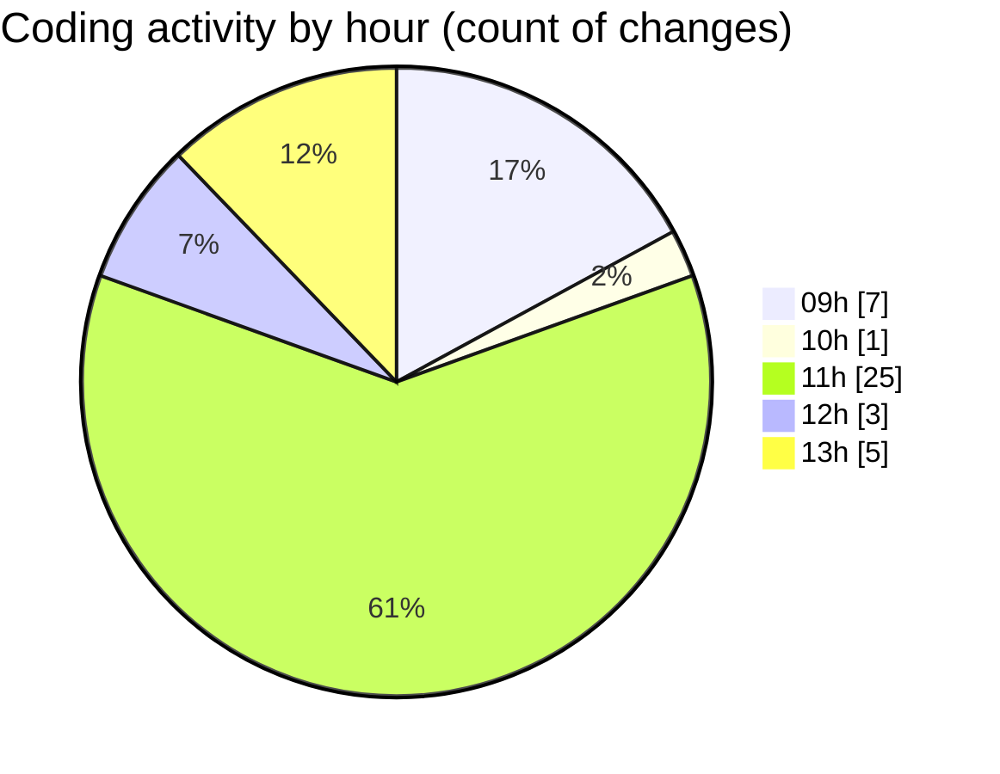

# cda - Activity Summary 

## Overall Statistics

| Stat                   | Value                                                             |
| ---------------------- | ----------------------------------------------------------------- |
| **Lines Added** (➕)   | 12322                                          |
| **Lines Removed** (➖) | 31                                        |
| **Net Change** (↕)    | 12291                |
| **Active Time** (⌚)   | 46 minutes |

## Modified Files
- **index.ts** (+686, -0)
- **clear-view-queries.ts** (+1477, -1)
- **clear-view-mutations.ts** (+1181, -6)
- **settings.json** (+100, -12)
- **clear-view-types.js** (+1238, -0)
- **errors.ts** (+15, -0)
- **Comment.ts** (+204, -12)
- **yarn.lock** (+4105, -0)
- **yarn.lock** (+3316, -0)

## Visualizations

### By File Type (Lines Changed)

### By Hour (Estimated Activity Count)

> **Last Updated:** 30/07/2025, 13:16:21