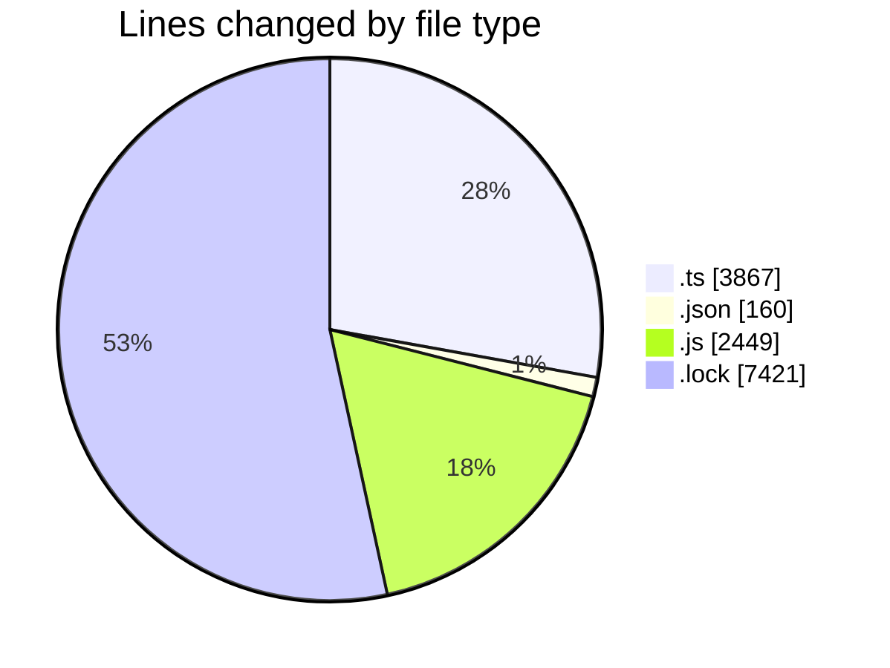
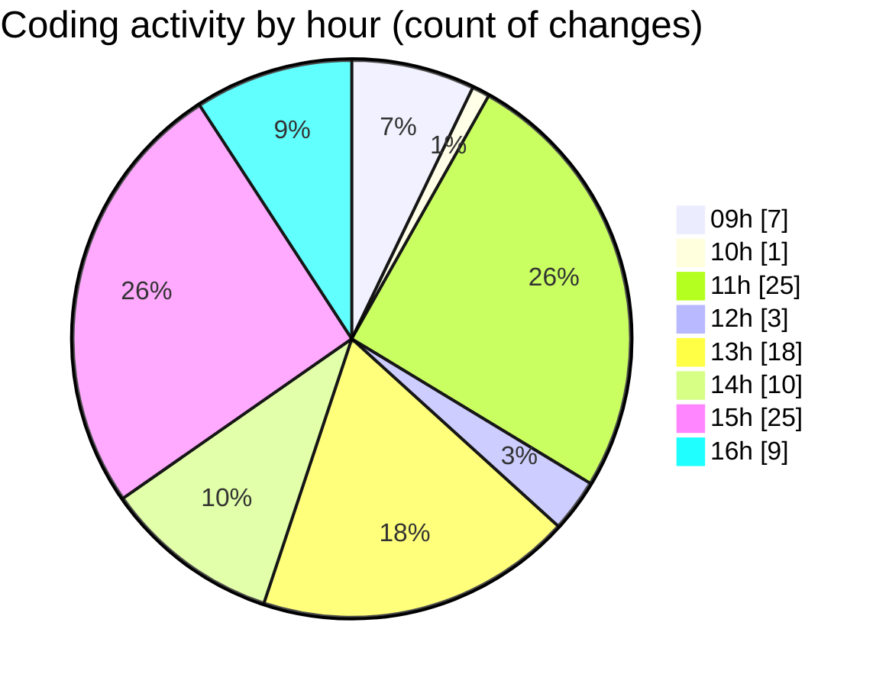

# cda - Activity Summary 

## Overall Statistics

| Stat                   | Value                                                             |
| ---------------------- | ----------------------------------------------------------------- |
| **Lines Added** (➕)   | 13728                                          |
| **Lines Removed** (➖) | 169                                        |
| **Net Change** (↕)    | 13559                |
| **Active Time** (⌚)   | 153 minutes |

## Modified Files
- **index.ts** (+686, -0)
- **clear-view-queries.ts** (+1478, -1)
- **clear-view-mutations.ts** (+1181, -6)
- **settings.json** (+124, -36)
- **clear-view-types.js** (+1238, -0)
- **errors.ts** (+15, -0)
- **Comment.ts** (+380, -120)
- **yarn.lock** (+4105, -0)
- **yarn.lock** (+3316, -0)
- **clear-view-mutations.js** (+683, -5)
- **clear-view-queries.js** (+522, -1)

## Visualizations

### By File Type (Lines Changed)

### By Hour (Estimated Activity Count)

> **Last Updated:** 30/07/2025, 16:42:25