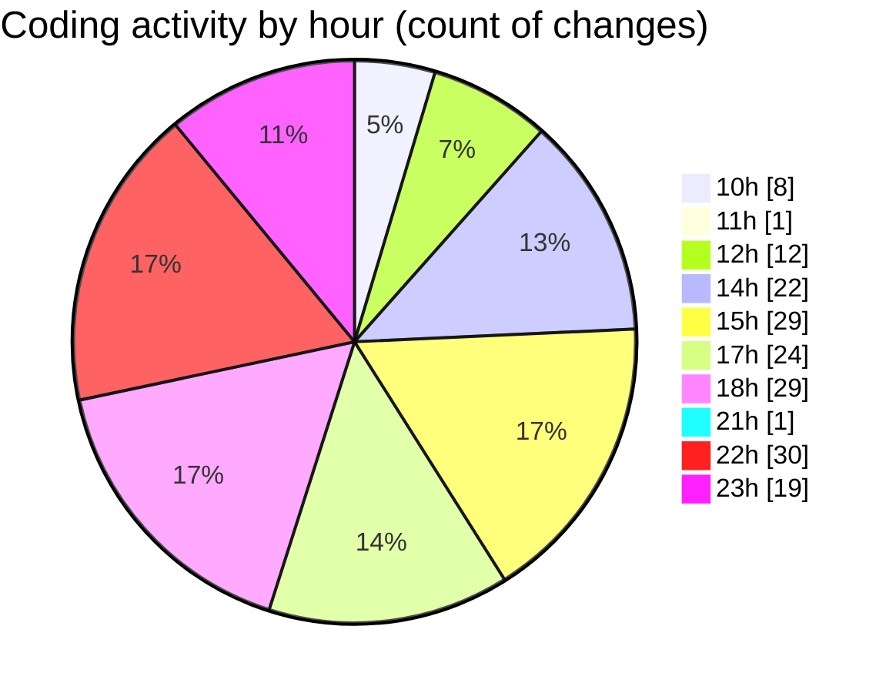

# cda - Activity Summary 

## Overall Statistics

| Stat                   | Value                                                             |
| ---------------------- | ----------------------------------------------------------------- |
| **Lines Added** (➕)   | 31217                                          |
| **Lines Removed** (➖) | 3607                                        |
| **Net Change** (↕)    | 27610                |
| **Active Time** (⌚)   | 269 minutes |

## Modified Files
- **Comment.ts** (+651, -549)
- **clear-view-queries.ts** (+741, -2)
- **resolvers-types.ts** (+27226, -2808)
- **clear-view-queries.js** (+522, -1)
- **settings.json** (+53, -12)
- **clear-view-types.js** (+1242, -2)
- **.env** (+41, -0)
- **commentOrm.ts** (+140, -69)
- **comment.ts** (+184, -142)
- **ClearView.ts** (+349, -0)
- **comment.ts** (+63, -22)
- **CommentService.test.ts** (+5, -0)

## Visualizations

### By File Type (Lines Changed)

### By Hour (Estimated Activity Count)

> **Last Updated:** 31/07/2025, 23:19:59