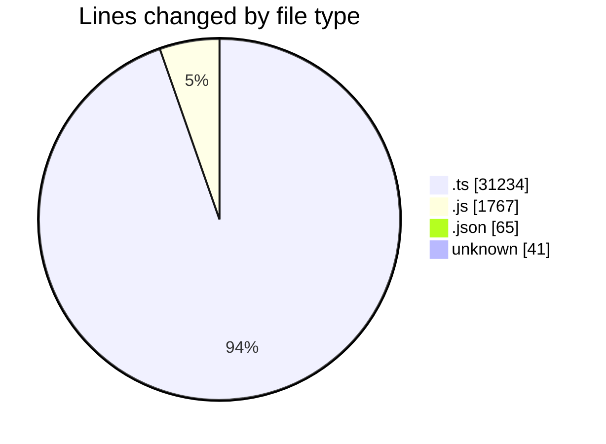
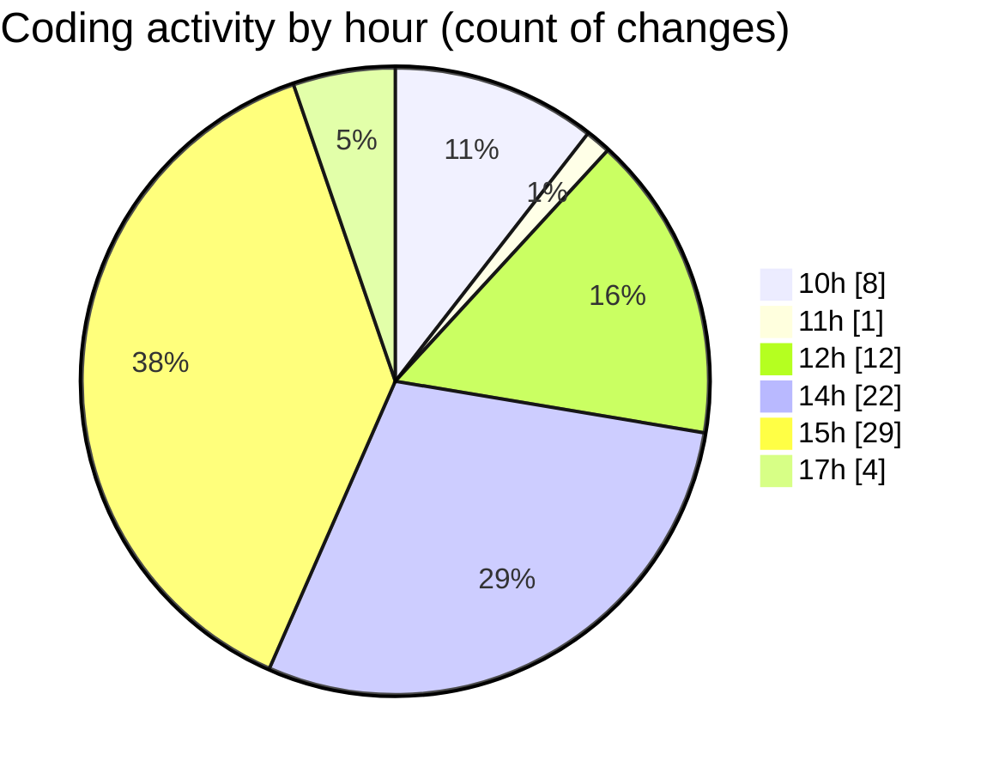

# cda - Activity Summary 

## Overall Statistics

| Stat                   | Value                                                             |
| ---------------------- | ----------------------------------------------------------------- |
| **Lines Added** (➕)   | 30126                                          |
| **Lines Removed** (➖) | 2981                                        |
| **Net Change** (↕)    | 27145                |
| **Active Time** (⌚)   | 91 minutes |

## Modified Files
- **Comment.ts** (+306, -156)
- **clear-view-queries.ts** (+741, -2)
- **resolvers-types.ts** (+27221, -2808)
- **clear-view-queries.js** (+522, -1)
- **settings.json** (+53, -12)
- **clear-view-types.js** (+1242, -2)
- **.env** (+41, -0)

## Visualizations

### By File Type (Lines Changed)

### By Hour (Estimated Activity Count)

> **Last Updated:** 31/07/2025, 17:34:55