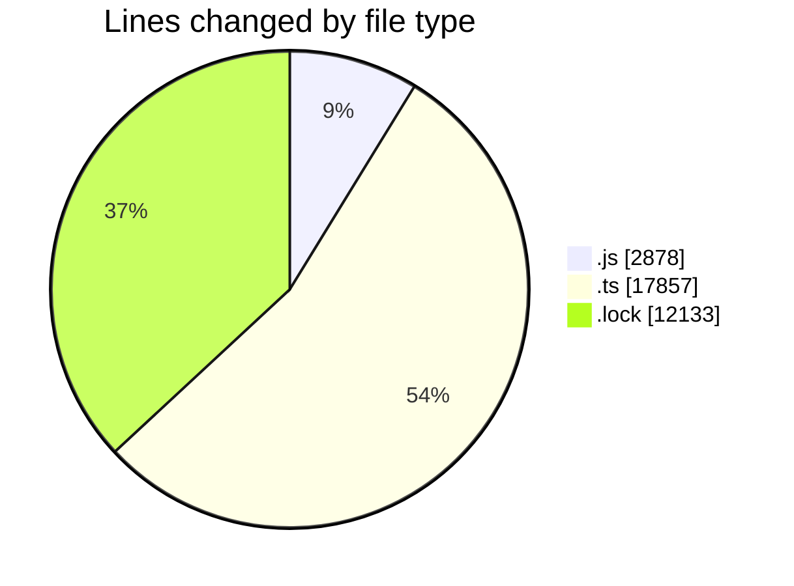
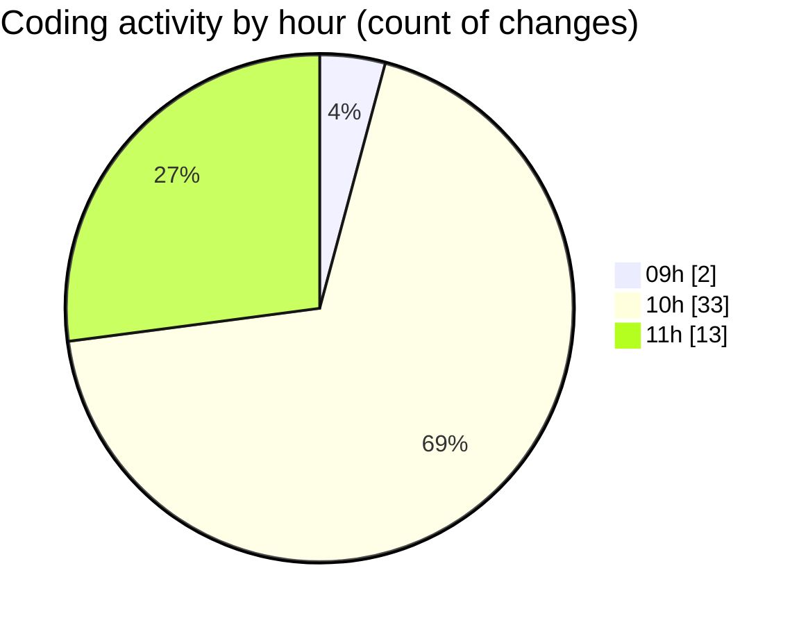

# cda - Activity Summary 

## Overall Statistics

| Stat                   | Value                                                             |
| ---------------------- | ----------------------------------------------------------------- |
| **Lines Added** (➕)   | 32864                                          |
| **Lines Removed** (➖) | 4                                        |
| **Net Change** (↕)    | 32860                |
| **Active Time** (⌚)   | 95 minutes |

## Modified Files
- **20250812085624-replace-initiative-comments-view.js** (+30, -0)
- **20250812090949-replace-cost-comments-view.js** (+33, -2)
- **20250812091650-replace-reinvestment-comments-view.js** (+33, -2)
- **20250812091806-replace-pool-comments-view.js** (+31, -0)
- **20250530164520-snapshot-reinvestments.js** (+53, -0)
- **20250812094852-replace-pool-position-comments-view.js** (+32, -0)
- **20250730061554-pool-positions.js** (+244, -0)
- **20250812095548-replace-target-comments-view.js** (+32, -0)
- **index.ts** (+342, -0)
- **clear-view-queries.ts** (+723, -0)
- **clear-view-mutations.js** (+659, -0)
- **clear-view-mutations.ts** (+567, -0)
- **clear-view-types.js** (+1225, -0)
- **clear-view-queries.js** (+502, -0)
- **resolvers-types.ts** (+12187, -0)
- **ClearView.ts** (+343, -0)
- **integration-tests.test.ts** (+145, -0)
- **yarn.lock** (+3317, -0)
- **yarn.lock** (+8816, -0)
- **clear_view_views.ts** (+3550, -0)

## Visualizations

### By File Type (Lines Changed)

### By Hour (Estimated Activity Count)

> **Last Updated:** 12/08/2025, 11:11:22