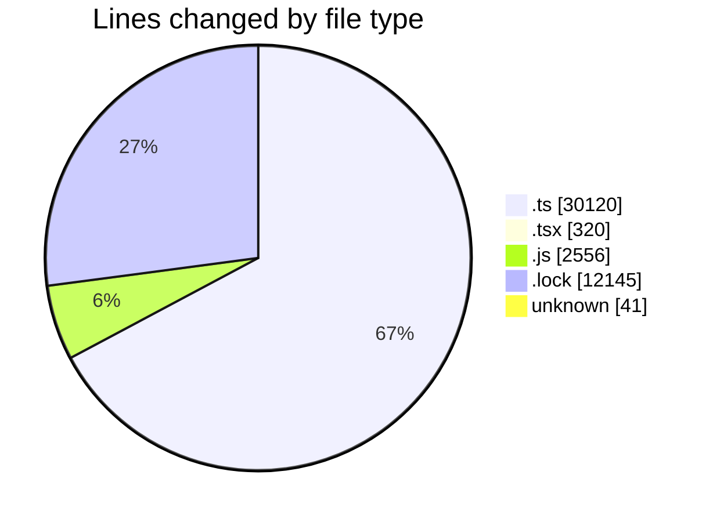
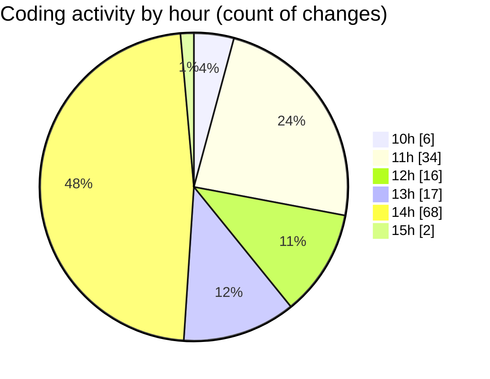

# cda - Activity Summary 

## Overall Statistics

| Stat                   | Value                                                             |
| ---------------------- | ----------------------------------------------------------------- |
| **Lines Added** (➕)   | 44600                                          |
| **Lines Removed** (➖) | 582                                        |
| **Net Change** (↕)    | 44018                |
| **Active Time** (⌚)   | 185 minutes |

## Modified Files
- **comments.ts** (+58, -4)
- **AdminHelper.tsx** (+299, -21)
- **graphql.ts** (+8132, -176)
- **comments.ts** (+80, -12)
- **Comment.ts** (+237, -54)
- **graphql.ts** (+5167, -36)
- **gql.ts** (+820, -0)
- **pools.ts** (+449, -8)
- **clear-view-mutations.js** (+698, -20)
- **clear-view-types.js** (+1261, -18)
- **yarn.lock** (+8817, -2)
- **clear-view-queries.js** (+540, -19)
- **resolvers-types.ts** (+12469, -141)
- **clear-view-mutations.ts** (+609, -22)
- **clear-view-queries.ts** (+755, -32)
- **ClearView.ts** (+356, -10)
- **index.ts** (+343, -2)
- **integration-tests.test.ts** (+146, -2)
- **yarn.lock** (+3323, -3)
- **.env** (+41, -0)

## Visualizations

### By File Type (Lines Changed)

### By Hour (Estimated Activity Count)

> **Last Updated:** 13/08/2025, 15:24:22