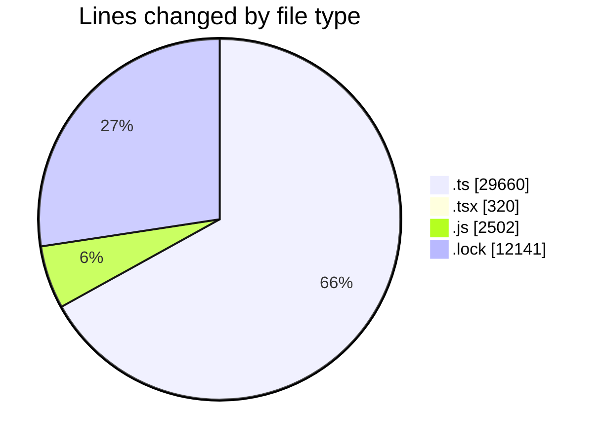
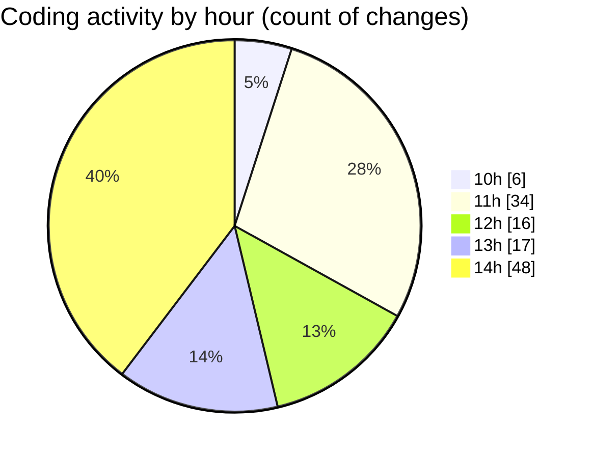

# cda - Activity Summary 

## Overall Statistics

| Stat                   | Value                                                             |
| ---------------------- | ----------------------------------------------------------------- |
| **Lines Added** (➕)   | 44242                                          |
| **Lines Removed** (➖) | 381                                        |
| **Net Change** (↕)    | 43861                |
| **Active Time** (⌚)   | 164 minutes |

## Modified Files
- **comments.ts** (+58, -4)
- **AdminHelper.tsx** (+299, -21)
- **graphql.ts** (+8049, -0)
- **comments.ts** (+80, -12)
- **Comment.ts** (+224, -48)
- **graphql.ts** (+5167, -36)
- **gql.ts** (+820, -0)
- **pools.ts** (+445, -8)
- **clear-view-mutations.js** (+679, -20)
- **clear-view-types.js** (+1245, -18)
- **yarn.lock** (+8817, -1)
- **clear-view-queries.js** (+521, -19)
- **resolvers-types.ts** (+12332, -141)
- **clear-view-mutations.ts** (+589, -22)
- **clear-view-queries.ts** (+755, -16)
- **ClearView.ts** (+353, -10)
- **index.ts** (+343, -1)
- **integration-tests.test.ts** (+146, -1)
- **yarn.lock** (+3320, -3)

## Visualizations

### By File Type (Lines Changed)

### By Hour (Estimated Activity Count)

> **Last Updated:** 13/08/2025, 14:29:22