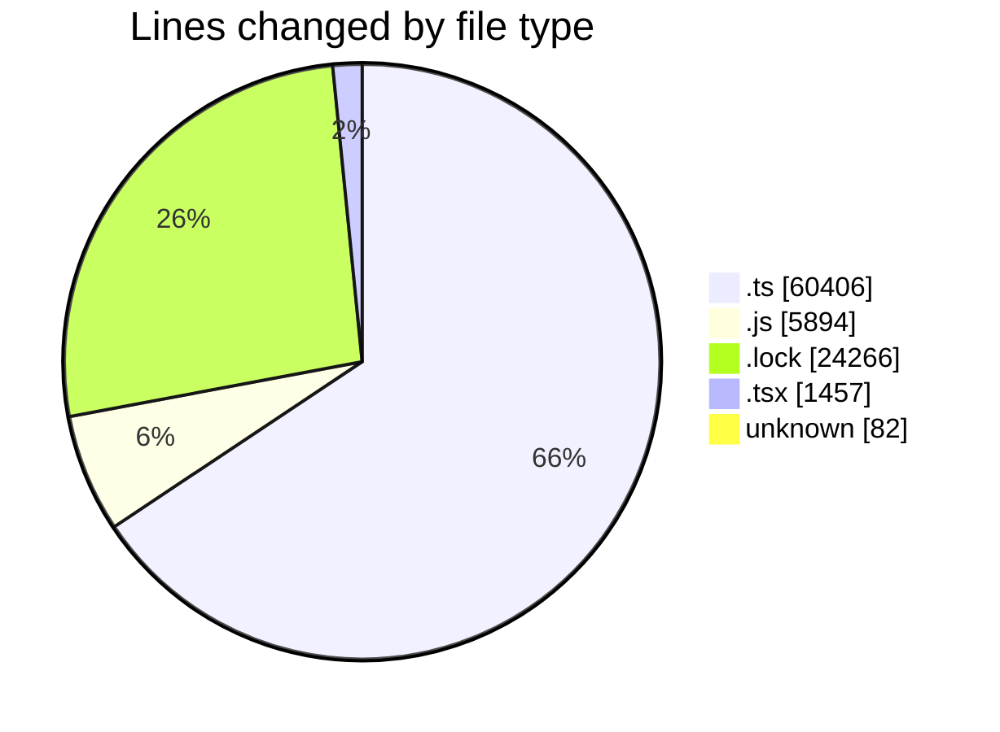
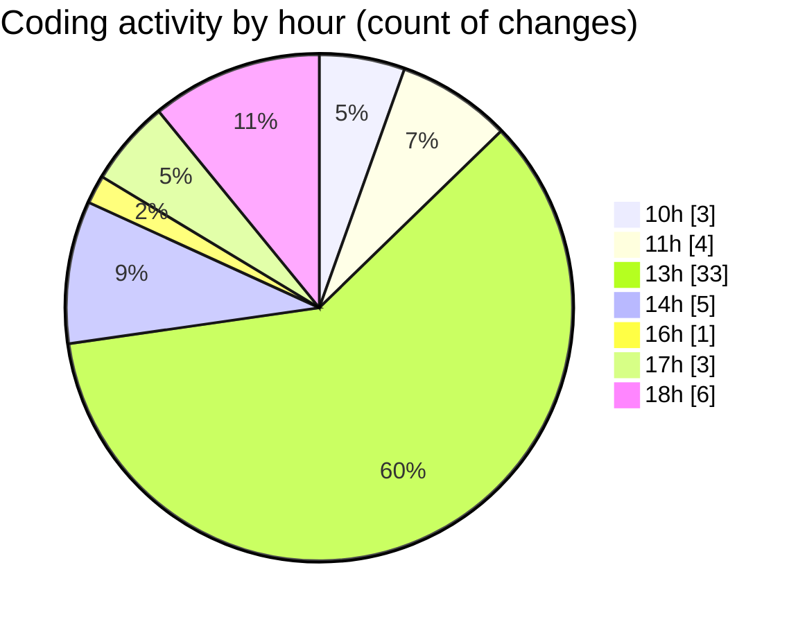

# cda - Activity Summary 

## Overall Statistics

| Stat                   | Value                                                             |
| ---------------------- | ----------------------------------------------------------------- |
| **Lines Added** (➕)   | 91990                                          |
| **Lines Removed** (➖) | 115                                        |
| **Net Change** (↕)    | 91875                |
| **Active Time** (⌚)   | 62 minutes |

## Modified Files
- **Comment.ts** (+182, -1)
- **clear-view-queries.ts** (+2233, -32)
- **resolvers-types.ts** (+9179, -38)
- **clear-view-queries.js** (+2084, -38)
- **resolvers-types.ts** (+36769, -0)
- **clear-view-types.js** (+2454, -0)
- **clear-view-mutations.js** (+1318, -0)
- **clear-view-mutations.ts** (+1721, -0)
- **yarn.lock** (+17632, -0)
- **index.ts** (+684, -0)
- **integration-tests.test.ts** (+290, -0)
- **ClearView.ts** (+686, -0)
- **yarn.lock** (+6634, -0)
- **graphql.ts** (+8039, -0)
- **AdminHelper.tsx** (+279, -1)
- **App.tsx** (+1175, -2)
- **random.ts** (+206, -0)
- **.env** (+82, -0)
- **ProposalService.ts** (+343, -3)

## Visualizations

### By File Type (Lines Changed)

### By Hour (Estimated Activity Count)

> **Last Updated:** 14/08/2025, 18:14:04