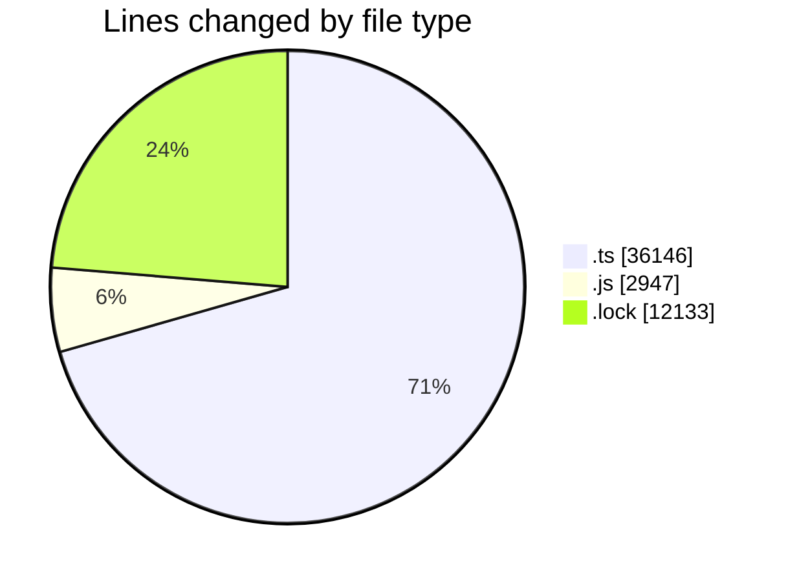
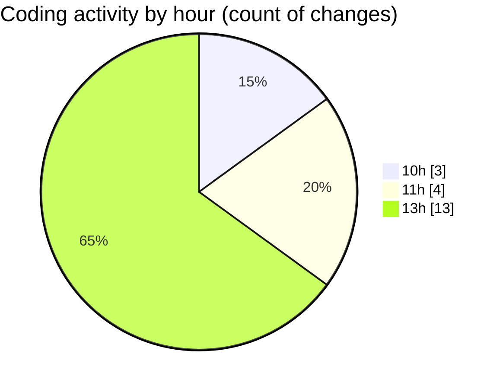

# cda - Activity Summary 

## Overall Statistics

| Stat                   | Value                                                             |
| ---------------------- | ----------------------------------------------------------------- |
| **Lines Added** (➕)   | 51152                                          |
| **Lines Removed** (➖) | 74                                        |
| **Net Change** (↕)    | 51078                |
| **Active Time** (⌚)   | 27 minutes |

## Modified Files
- **Comment.ts** (+182, -1)
- **clear-view-queries.ts** (+755, -16)
- **resolvers-types.ts** (+9179, -38)
- **clear-view-queries.js** (+1042, -19)
- **resolvers-types.ts** (+24578, -0)
- **clear-view-types.js** (+1227, -0)
- **clear-view-mutations.js** (+659, -0)
- **clear-view-mutations.ts** (+567, -0)
- **yarn.lock** (+8816, -0)
- **index.ts** (+342, -0)
- **integration-tests.test.ts** (+145, -0)
- **ClearView.ts** (+343, -0)
- **yarn.lock** (+3317, -0)

## Visualizations

### By File Type (Lines Changed)

### By Hour (Estimated Activity Count)

> **Last Updated:** 14/08/2025, 13:43:33