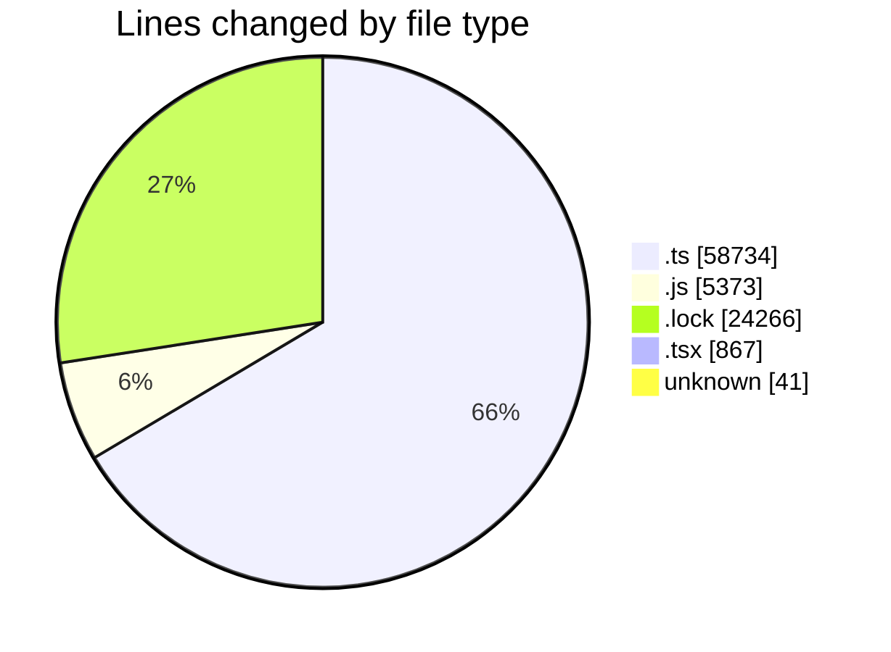
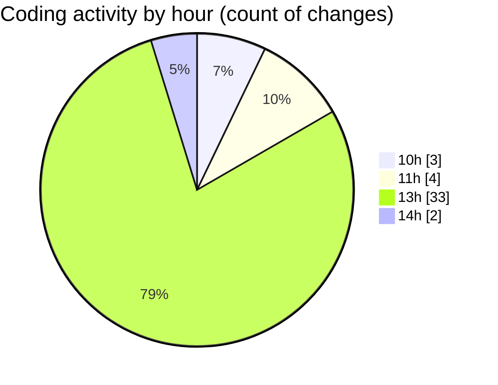

# cda - Activity Summary 

## Overall Statistics

| Stat                   | Value                                                             |
| ---------------------- | ----------------------------------------------------------------- |
| **Lines Added** (➕)   | 89171                                          |
| **Lines Removed** (➖) | 110                                        |
| **Net Change** (↕)    | 89061                |
| **Active Time** (⌚)   | 51 minutes |

## Modified Files
- **Comment.ts** (+182, -1)
- **clear-view-queries.ts** (+1494, -32)
- **resolvers-types.ts** (+9179, -38)
- **clear-view-queries.js** (+1563, -38)
- **resolvers-types.ts** (+36769, -0)
- **clear-view-types.js** (+2454, -0)
- **clear-view-mutations.js** (+1318, -0)
- **clear-view-mutations.ts** (+1134, -0)
- **yarn.lock** (+17632, -0)
- **index.ts** (+684, -0)
- **integration-tests.test.ts** (+290, -0)
- **ClearView.ts** (+686, -0)
- **yarn.lock** (+6634, -0)
- **graphql.ts** (+8039, -0)
- **AdminHelper.tsx** (+279, -1)
- **App.tsx** (+587, -0)
- **random.ts** (+206, -0)
- **.env** (+41, -0)

## Visualizations

### By File Type (Lines Changed)

### By Hour (Estimated Activity Count)

> **Last Updated:** 14/08/2025, 14:20:33