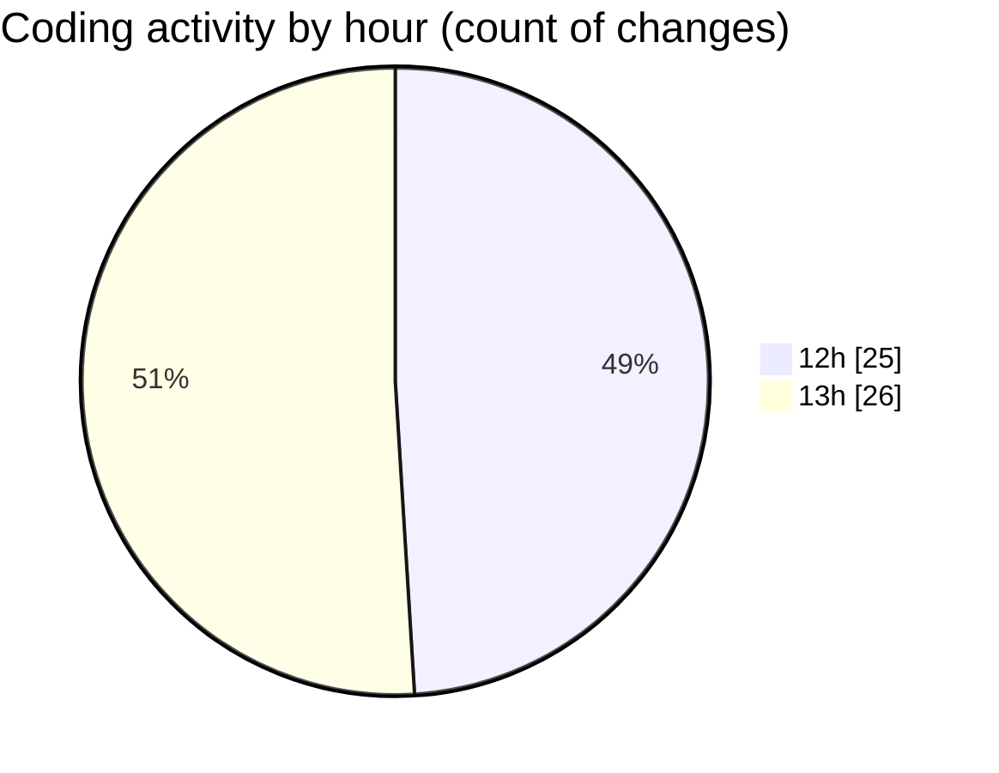

# cda - Activity Summary 

## Overall Statistics

| Stat                   | Value                                                             |
| ---------------------- | ----------------------------------------------------------------- |
| **Lines Added** (➕)   | 25080                                          |
| **Lines Removed** (➖) | 347                                        |
| **Net Change** (↕)    | 24733                |
| **Active Time** (⌚)   | 75 minutes |

## Modified Files
- **clear-view-queries.js** (+521, -2)
- **resolvers-types.ts** (+9179, -0)
- **Comment.ts** (+469, -304)
- **comments.ts** (+185, -0)
- **CommentService.test.ts** (+400, -0)
- **clear-view-queries.ts** (+749, -14)
- **clear-view-mutations.ts** (+587, -0)
- **resolvers-types.ts** (+12387, -15)
- **.env** (+41, -0)
- **ClearView.ts** (+350, -0)
- **settings.json** (+43, -0)
- **CommentService.ts** (+169, -12)

## Visualizations

### By File Type (Lines Changed)

### By Hour (Estimated Activity Count)

> **Last Updated:** 15/08/2025, 13:58:07