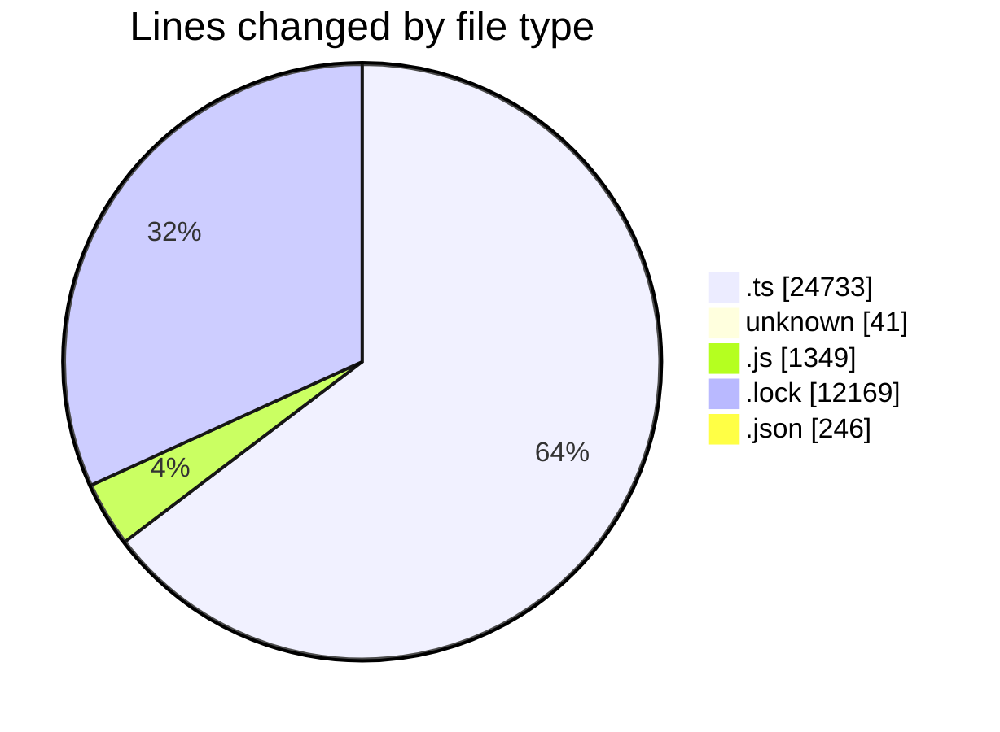
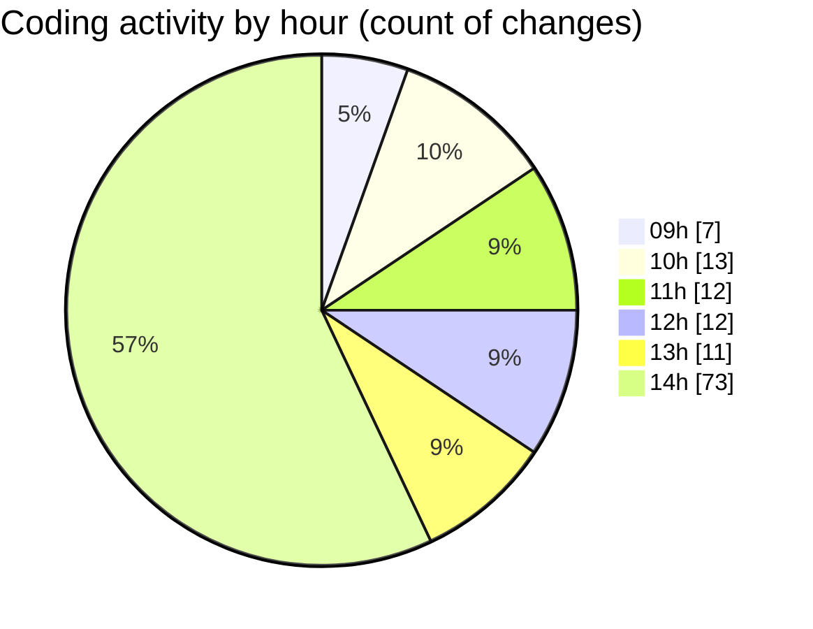

# cda - Activity Summary 

## Overall Statistics

| Stat                   | Value                                                             |
| ---------------------- | ----------------------------------------------------------------- |
| **Lines Added** (➕)   | 37733                                          |
| **Lines Removed** (➖) | 805                                        |
| **Net Change** (↕)    | 36928                |
| **Active Time** (⌚)   | 174 minutes |

## Modified Files
- **comments.ts** (+194, -23)
- **.env** (+41, -0)
- **CommentService.test.ts** (+598, -359)
- **CommentService.ts** (+193, -35)
- **comment.ts** (+90, -16)
- **clear-view-mutations.ts** (+631, -64)
- **ClearView.ts** (+356, -13)
- **clear-view-queries.ts** (+767, -44)
- **clear-view-queries.js** (+557, -55)
- **yarn.lock** (+8827, -11)
- **clear-view-mutations.js** (+698, -39)
- **index.ts** (+345, -3)
- **yarn.lock** (+3324, -7)
- **graphql.ts** (+8039, -83)
- **TargetService.ts** (+402, -24)
- **package.json** (+67, -0)
- **package.json** (+108, -6)
- **package.json** (+64, -1)
- **resolvers-types.ts** (+12378, -0)
- **comments.ts** (+54, -22)

## Visualizations

### By File Type (Lines Changed)

### By Hour (Estimated Activity Count)

> **Last Updated:** 18/08/2025, 14:54:26