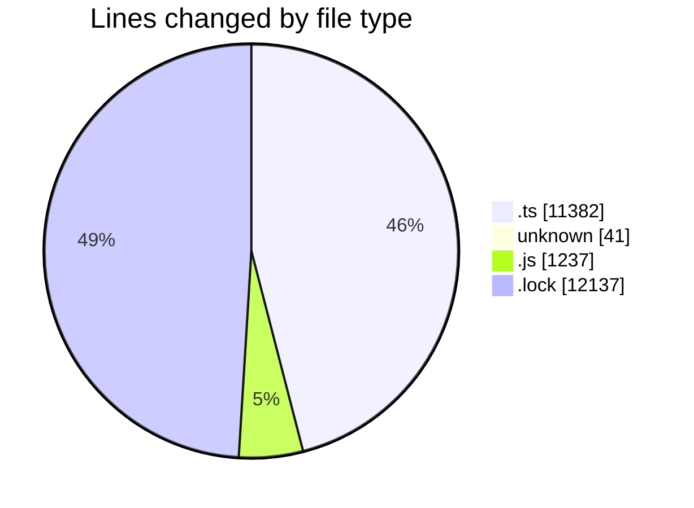
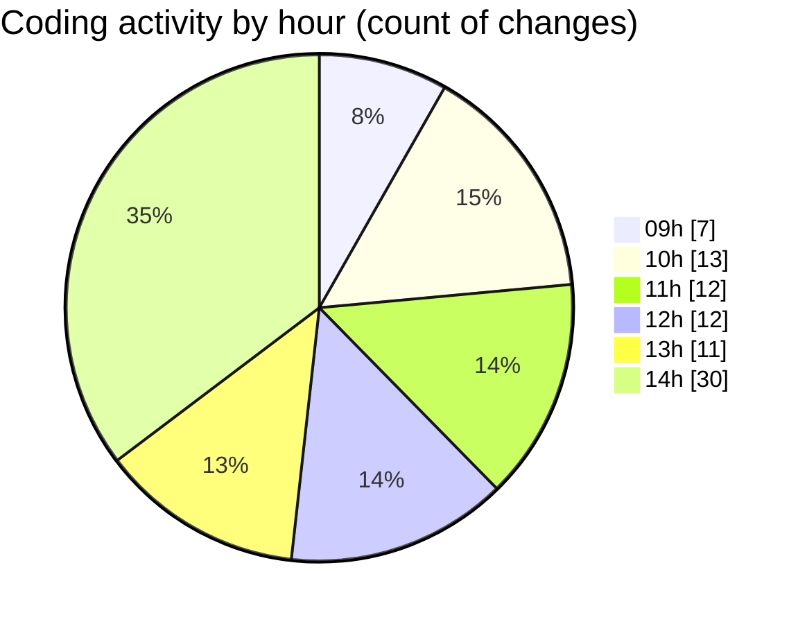

# cda - Activity Summary 

## Overall Statistics

| Stat                   | Value                                                             |
| ---------------------- | ----------------------------------------------------------------- |
| **Lines Added** (➕)   | 24479                                          |
| **Lines Removed** (➖) | 318                                        |
| **Net Change** (↕)    | 24161                |
| **Active Time** (⌚)   | 89 minutes |

## Modified Files
- **comments.ts** (+194, -9)
- **.env** (+41, -0)
- **CommentService.test.ts** (+598, -198)
- **CommentService.ts** (+193, -35)
- **comment.ts** (+90, -16)
- **clear-view-mutations.ts** (+607, -20)
- **ClearView.ts** (+349, -3)
- **clear-view-queries.ts** (+755, -16)
- **clear-view-queries.js** (+540, -19)
- **yarn.lock** (+8816, -1)
- **clear-view-mutations.js** (+678, -0)
- **index.ts** (+342, -1)
- **yarn.lock** (+3320, -0)
- **graphql.ts** (+7956, -0)

## Visualizations

### By File Type (Lines Changed)

### By Hour (Estimated Activity Count)

> **Last Updated:** 18/08/2025, 14:44:26