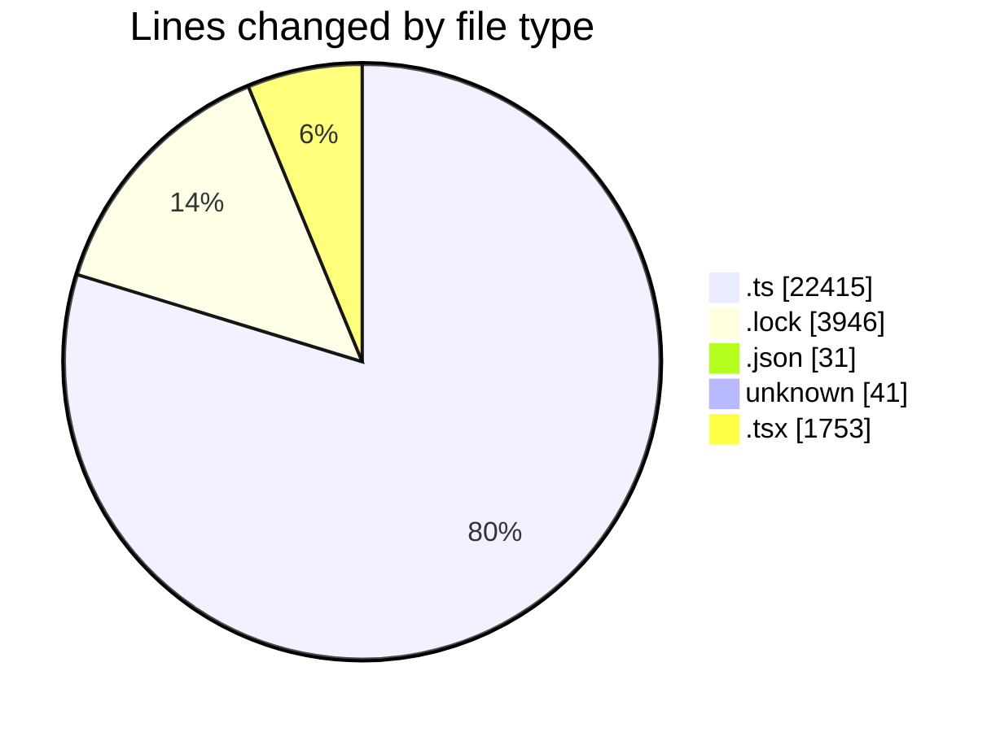
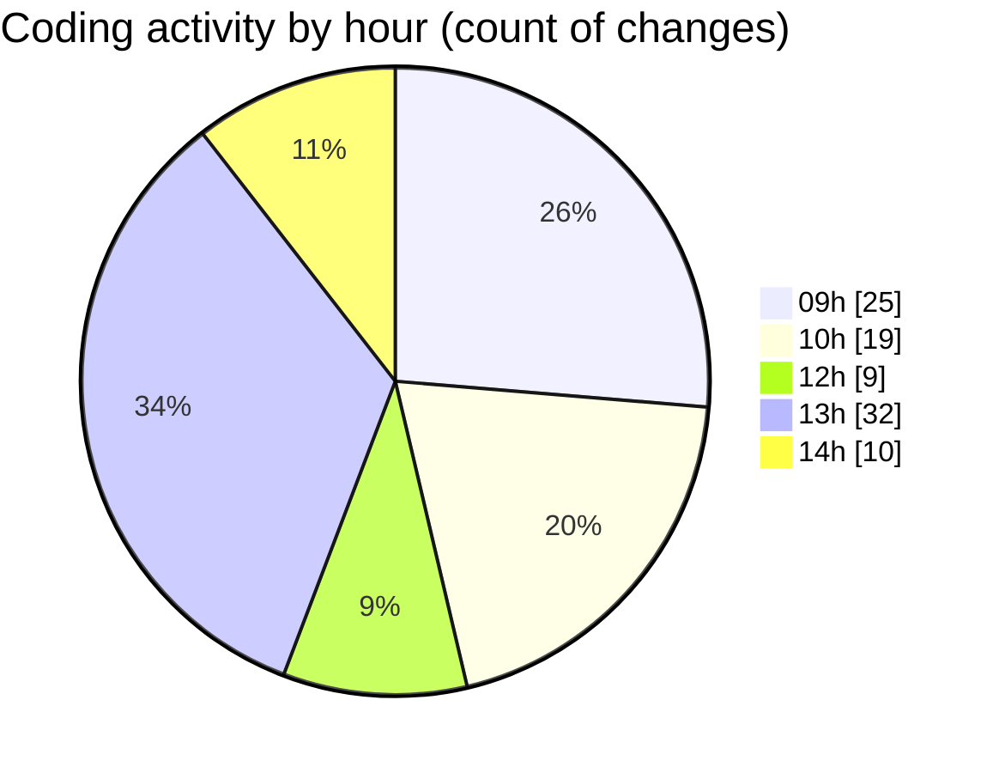

# cda - Activity Summary 

## Overall Statistics

| Stat                   | Value                                                             |
| ---------------------- | ----------------------------------------------------------------- |
| **Lines Added** (➕)   | 27808                                          |
| **Lines Removed** (➖) | 378                                        |
| **Net Change** (↕)    | 27430                |
| **Active Time** (⌚)   | 156 minutes |

## Modified Files
- **CommentService.ts** (+458, -246)
- **comment.ts** (+5, -0)
- **yarn.lock** (+3856, -0)
- **yarn.lock** (+90, -0)
- **comment.ts** (+177, -111)
- **package.json** (+31, -0)
- **comments.ts** (+68, -0)
- **comments.ts** (+32, -0)
- **resolvers-types.ts** (+12380, -0)
- **clear-view-queries.ts** (+735, -0)
- **.env** (+41, -0)
- **index.tsx** (+84, -0)
- **CommentItem.tsx** (+172, -0)
- **Details.tsx** (+781, -0)
- **CommentItemList.tsx** (+75, -0)
- **CommentItemList.tsx** (+75, -0)
- **CommentItem.tsx** (+182, -13)
- **index.tsx** (+4, -0)
- **CommentBotIcon.tsx** (+18, -0)
- **graphql.ts** (+8079, -0)
- **CommentItemList.tsx** (+88, -6)
- **AddComment.tsx** (+69, -0)
- **config.ts** (+124, -0)
- **CommentItem.test.tsx** (+184, -2)

## Visualizations

### By File Type (Lines Changed)

### By Hour (Estimated Activity Count)

> **Last Updated:** 19/08/2025, 14:17:09