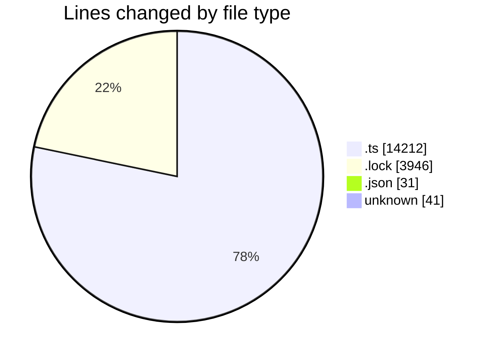
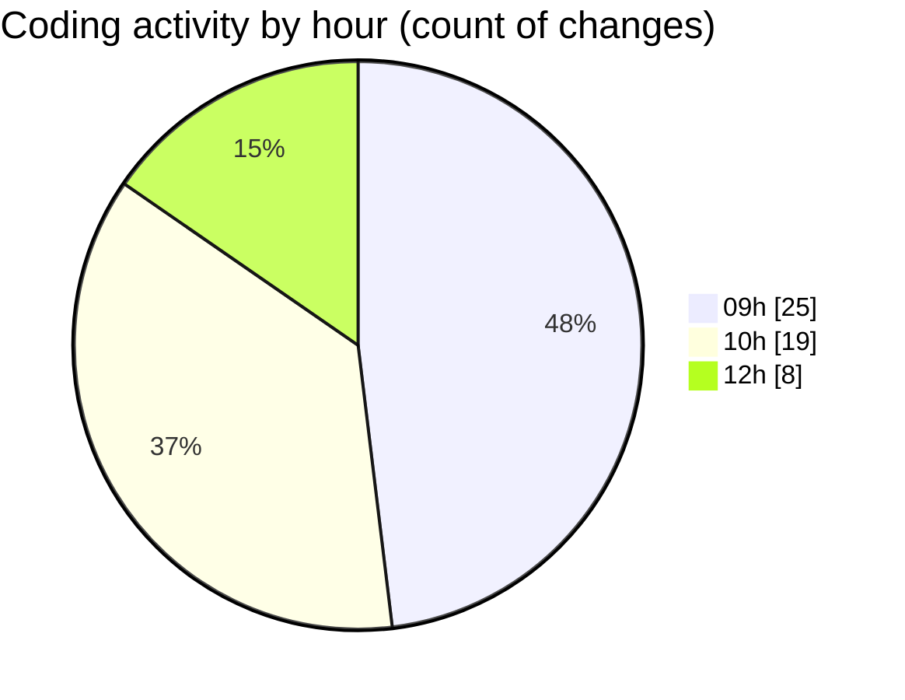

# cda - Activity Summary 

## Overall Statistics

| Stat                   | Value                                                             |
| ---------------------- | ----------------------------------------------------------------- |
| **Lines Added** (➕)   | 17873                                          |
| **Lines Removed** (➖) | 357                                        |
| **Net Change** (↕)    | 17516                |
| **Active Time** (⌚)   | 82 minutes |

## Modified Files
- **CommentService.ts** (+458, -246)
- **comment.ts** (+5, -0)
- **yarn.lock** (+3856, -0)
- **yarn.lock** (+90, -0)
- **comment.ts** (+177, -111)
- **package.json** (+31, -0)
- **comments.ts** (+68, -0)
- **comments.ts** (+32, -0)
- **resolvers-types.ts** (+12380, -0)
- **clear-view-queries.ts** (+735, -0)
- **.env** (+41, -0)

## Visualizations

### By File Type (Lines Changed)

### By Hour (Estimated Activity Count)

> **Last Updated:** 19/08/2025, 12:57:09