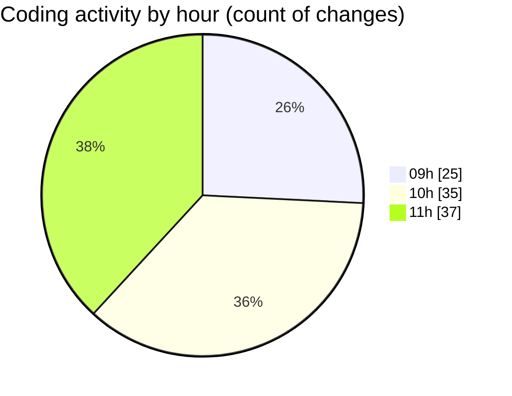

# cda - Activity Summary 

## Overall Statistics

| Stat                   | Value                                                             |
| ---------------------- | ----------------------------------------------------------------- |
| **Lines Added** (➕)   | 172438                                          |
| **Lines Removed** (➖) | 109640                                        |
| **Net Change** (↕)    | 62798                |
| **Active Time** (⌚)   | 129 minutes |

## Modified Files
- **clear-view-queries.ts** (+735, -1)
- **CommentService.test.ts** (+426, -117)
- **comments.ts** (+340, -170)
- **resolvers-types.ts** (+13179, -617)
- **App.tsx** (+589, -2)
- **gql.ts** (+3280, -24)
- **clear-view-mutations.ts** (+609, -21)
- **graphql.ts** (+133004, -108482)
- **resolvers-types.ts** (+9179, -161)
- **comments.ts** (+68, -0)
- **comments.ts** (+162, -44)
- **AddComment.tsx** (+73, -0)
- **config.ts** (+246, -0)
- **graphql.ts** (+10362, -0)
- **CommentItem.tsx** (+186, -1)

## Visualizations

### By File Type (Lines Changed)

### By Hour (Estimated Activity Count)

> **Last Updated:** 22/08/2025, 11:25:14