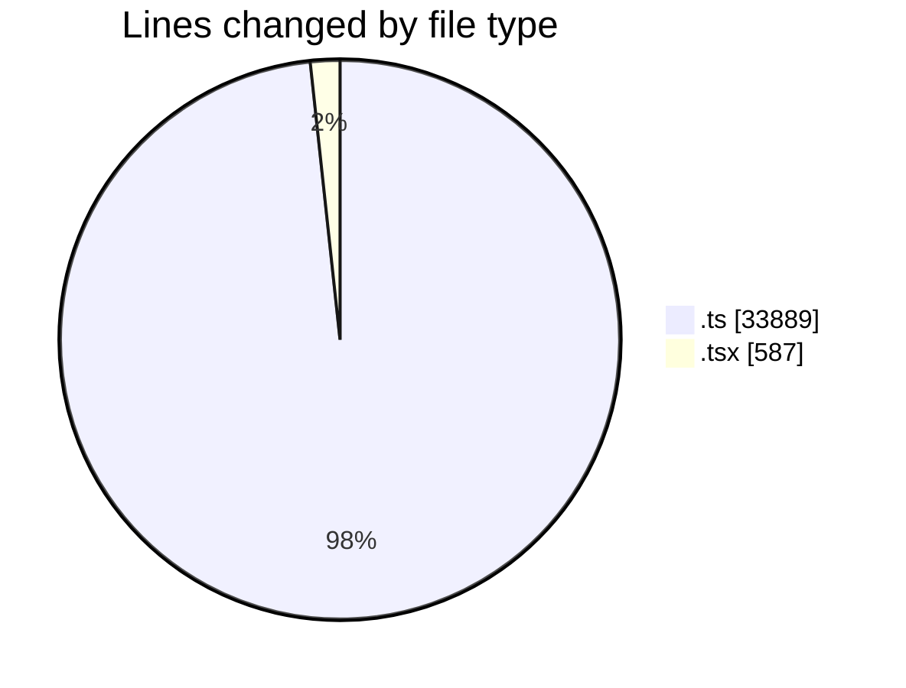
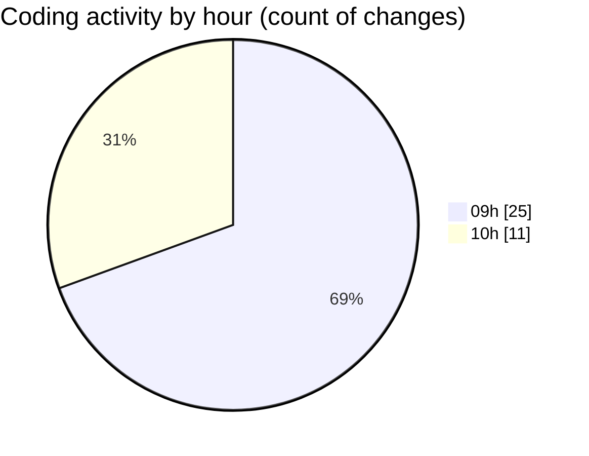

# cda - Activity Summary 

## Overall Statistics

| Stat                   | Value                                                             |
| ---------------------- | ----------------------------------------------------------------- |
| **Lines Added** (➕)   | 33550                                          |
| **Lines Removed** (➖) | 926                                        |
| **Net Change** (↕)    | 32624                |
| **Active Time** (⌚)   | 53 minutes |

## Modified Files
- **clear-view-queries.ts** (+735, -1)
- **CommentService.test.ts** (+426, -117)
- **comments.ts** (+340, -170)
- **resolvers-types.ts** (+12808, -617)
- **App.tsx** (+587, -0)
- **gql.ts** (+796, -0)
- **clear-view-mutations.ts** (+588, -21)
- **graphql.ts** (+8091, -0)
- **resolvers-types.ts** (+9179, -0)

## Visualizations

### By File Type (Lines Changed)

### By Hour (Estimated Activity Count)

> **Last Updated:** 22/08/2025, 10:21:13