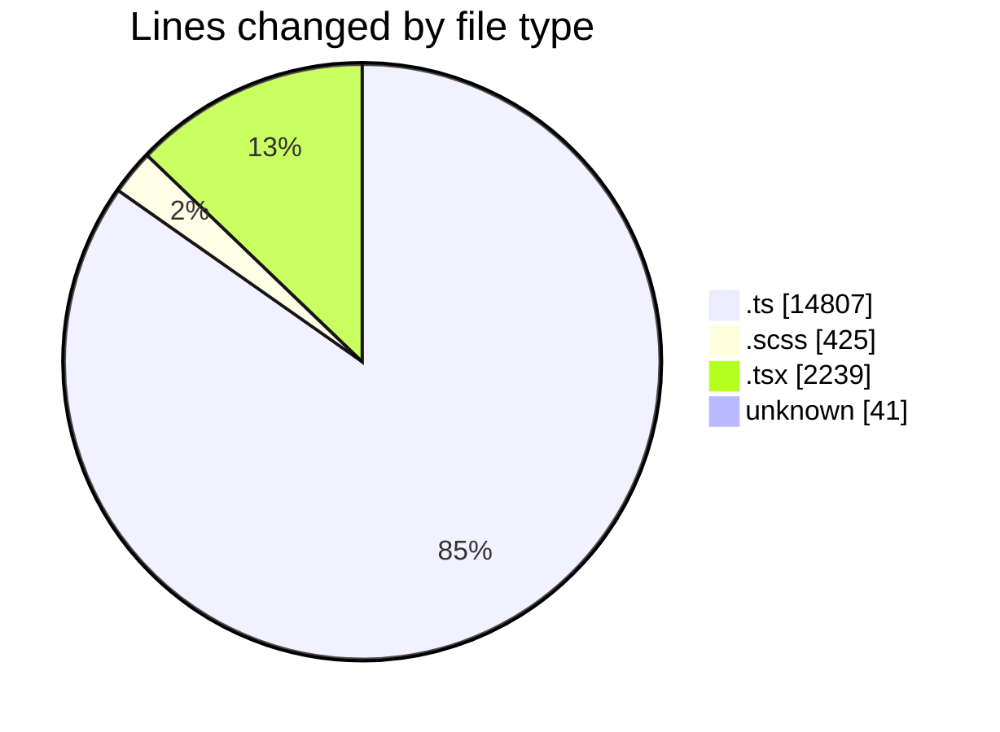
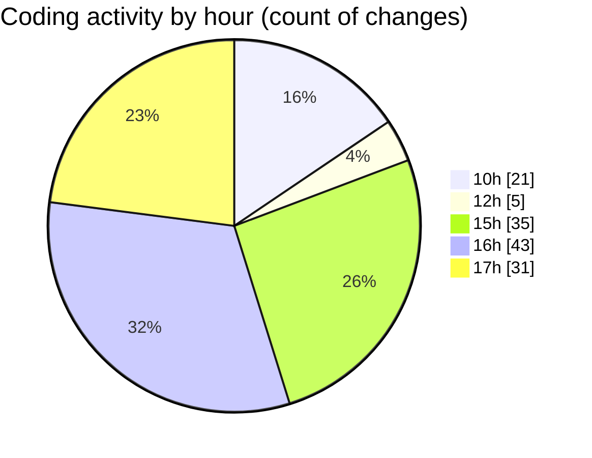

# cda - Activity Summary 

## Overall Statistics

| Stat                   | Value                                                             |
| ---------------------- | ----------------------------------------------------------------- |
| **Lines Added** (➕)   | 17042                                          |
| **Lines Removed** (➖) | 470                                        |
| **Net Change** (↕)    | 16572                |
| **Active Time** (⌚)   | 199 minutes |

## Modified Files
- **comments.ts** (+68, -22)
- **gql.ts** (+844, -30)
- **graphql.ts** (+8272, -108)
- **graphql.ts** (+5237, -56)
- **CommentItem.scss** (+132, -0)
- **CommentItemList.tsx** (+392, -41)
- **CommentItem.tsx** (+478, -92)
- **PoolDetails.tsx** (+726, -79)
- **AddComment.tsx** (+88, -14)
- **AddComment.scss** (+81, -22)
- **comments.ts** (+170, -0)
- **AddComment.test.tsx** (+86, -6)
- **.env** (+41, -0)
- **CommentItem.scss** (+190, -0)
- **App.tsx** (+237, -0)

## Visualizations

### By File Type (Lines Changed)

### By Hour (Estimated Activity Count)

> **Last Updated:** 27/08/2025, 17:53:00