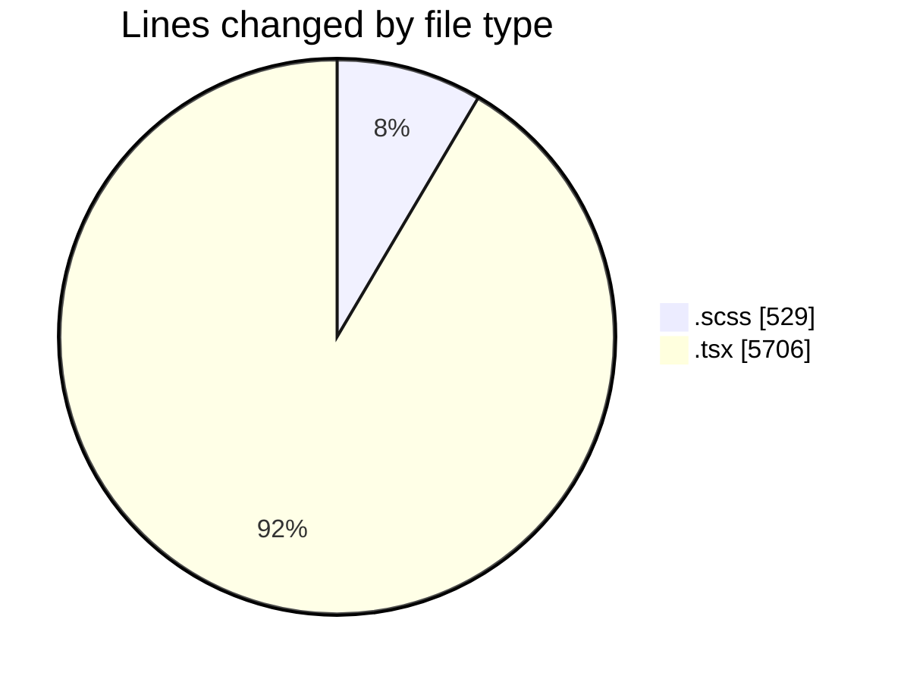
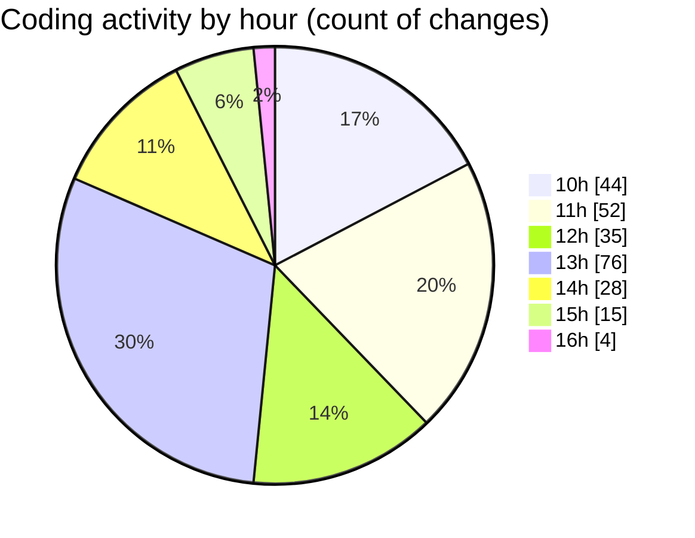

# cda - Activity Summary 

## Overall Statistics

| Stat                   | Value                                                             |
| ---------------------- | ----------------------------------------------------------------- |
| **Lines Added** (➕)   | 5445                                          |
| **Lines Removed** (➖) | 790                                        |
| **Net Change** (↕)    | 4655                |
| **Active Time** (⌚)   | 348 minutes |

## Modified Files
- **CommentItem.scss** (+219, -34)
- **CommentItem.tsx** (+173, -25)
- **CommentItem.test.tsx** (+225, -81)
- **App.tsx** (+1761, -0)
- **CommentItemList.tsx** (+583, -136)
- **AddComment.scss** (+59, -0)
- **CommentItemList.scss** (+161, -56)
- **CommentItemList.test.tsx** (+217, -80)
- **PoolDetails.tsx** (+1298, -1)
- **CostDetails.tsx** (+749, -377)

## Visualizations

### By File Type (Lines Changed)

### By Hour (Estimated Activity Count)

> **Last Updated:** 28/08/2025, 16:17:03