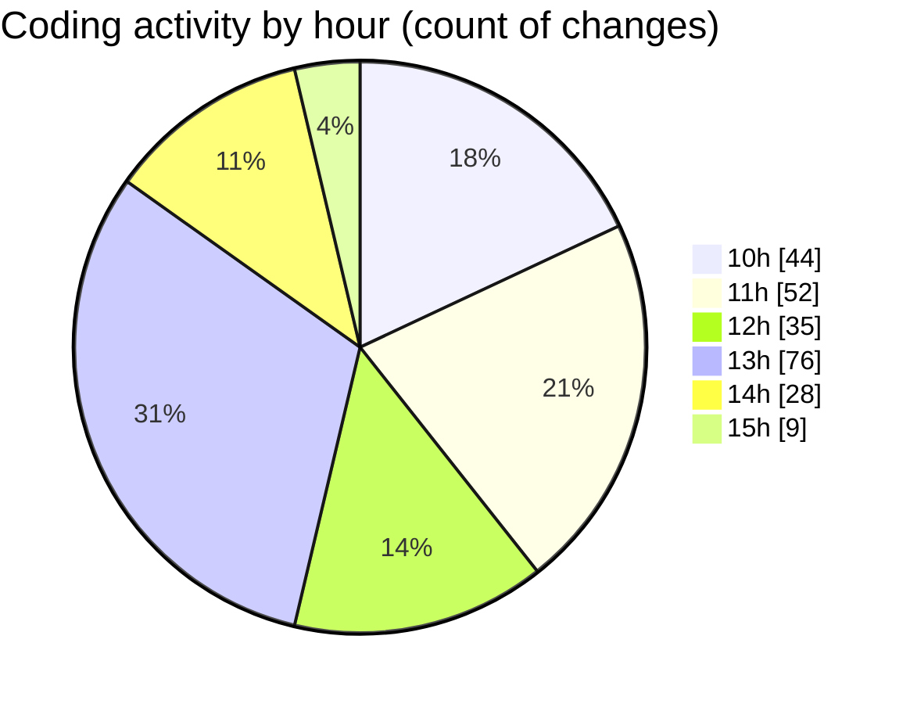

# cda - Activity Summary 

## Overall Statistics

| Stat                   | Value                                                             |
| ---------------------- | ----------------------------------------------------------------- |
| **Lines Added** (➕)   | 4420                                          |
| **Lines Removed** (➖) | 419                                        |
| **Net Change** (↕)    | 4001                |
| **Active Time** (⌚)   | 328 minutes |

## Modified Files
- **CommentItem.scss** (+219, -34)
- **CommentItem.tsx** (+173, -25)
- **CommentItem.test.tsx** (+225, -81)
- **App.tsx** (+1761, -0)
- **CommentItemList.tsx** (+583, -136)
- **AddComment.scss** (+59, -0)
- **CommentItemList.scss** (+161, -56)
- **CommentItemList.test.tsx** (+217, -80)
- **PoolDetails.tsx** (+647, -1)
- **CostDetails.tsx** (+375, -6)

## Visualizations

### By File Type (Lines Changed)

### By Hour (Estimated Activity Count)

> **Last Updated:** 28/08/2025, 15:52:03