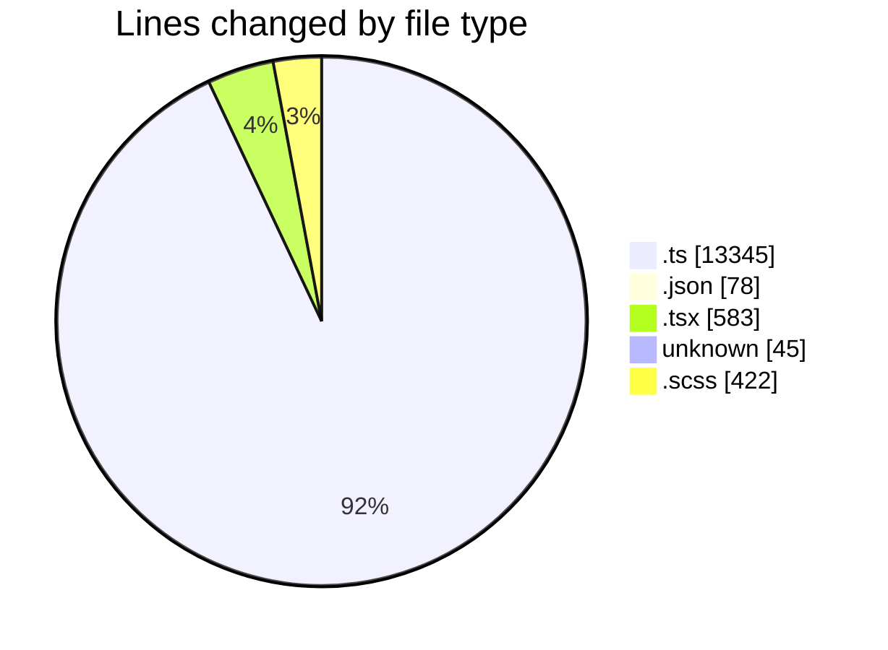
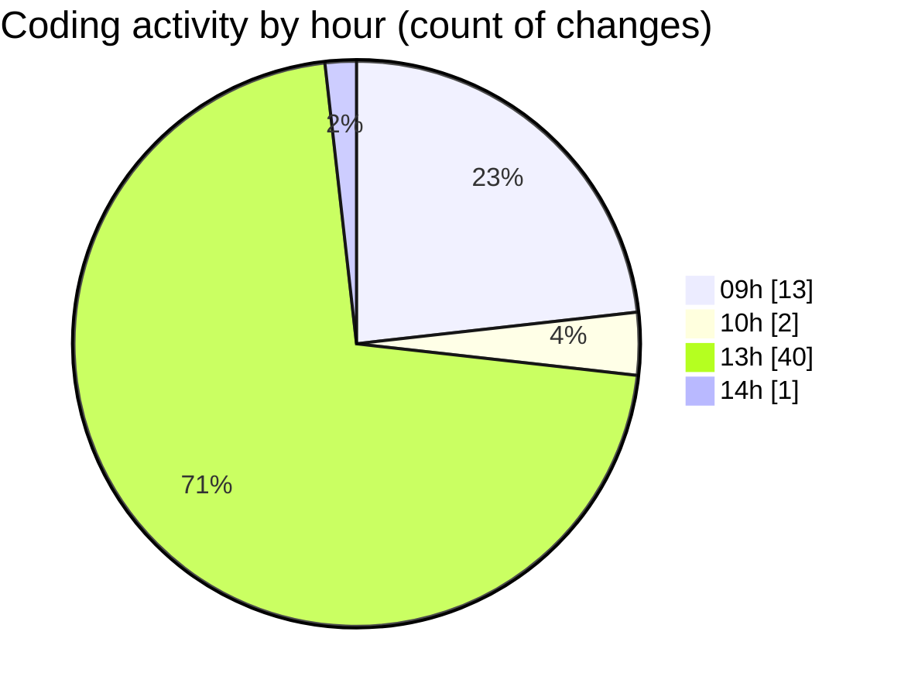

# cda - Activity Summary 

## Overall Statistics

| Stat                   | Value                                                             |
| ---------------------- | ----------------------------------------------------------------- |
| **Lines Added** (➕)   | 14348                                          |
| **Lines Removed** (➖) | 125                                        |
| **Net Change** (↕)    | 14223                |
| **Active Time** (⌚)   | 70 minutes |

## Modified Files
- **graphql.ts** (+5181, -0)
- **graphql.ts** (+8164, -0)
- **package.json** (+78, -0)
- **AddComment.test.tsx** (+79, -30)
- **AddComment.tsx** (+75, -0)
- **CostDetails.tsx** (+1, -4)
- **PoolDetails.tsx** (+0, -38)
- **.env** (+45, -0)
- **CommentItem.scss** (+392, -30)
- **CommentItem.tsx** (+163, -15)
- **CommentItemList.tsx** (+170, -8)

## Visualizations

### By File Type (Lines Changed)

### By Hour (Estimated Activity Count)

> **Last Updated:** 29/08/2025, 14:05:20