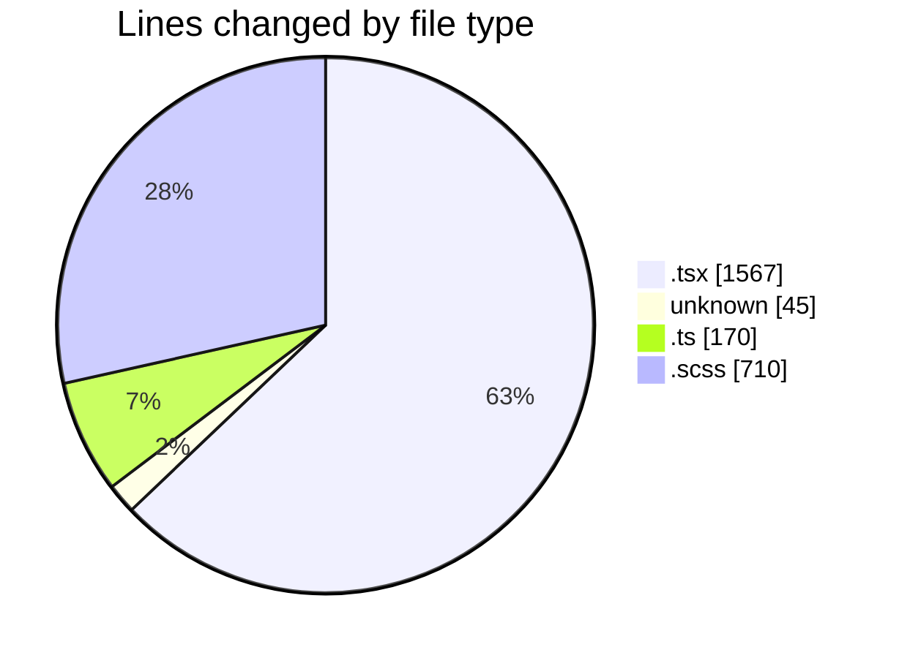
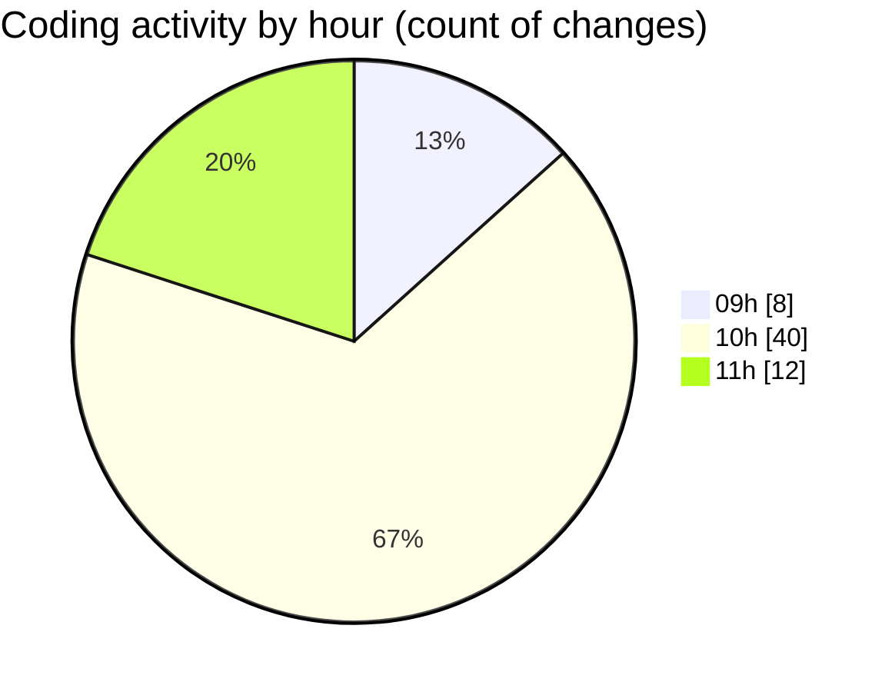

# cda - Activity Summary 

## Overall Statistics

| Stat                   | Value                                                             |
| ---------------------- | ----------------------------------------------------------------- |
| **Lines Added** (➕)   | 2127                                          |
| **Lines Removed** (➖) | 365                                        |
| **Net Change** (↕)    | 1762                |
| **Active Time** (⌚)   | 100 minutes |

## Modified Files
- **CommentItem.tsx** (+148, -2)
- **CostDetails.tsx** (+344, -2)
- **.env** (+45, -0)
- **App.tsx** (+587, -1)
- **CommentItemList.tsx** (+367, -116)
- **comments.ts** (+170, -0)
- **CommentItem.scss** (+466, -244)

## Visualizations

### By File Type (Lines Changed)

### By Hour (Estimated Activity Count)

> **Last Updated:** 01/09/2025, 11:10:23