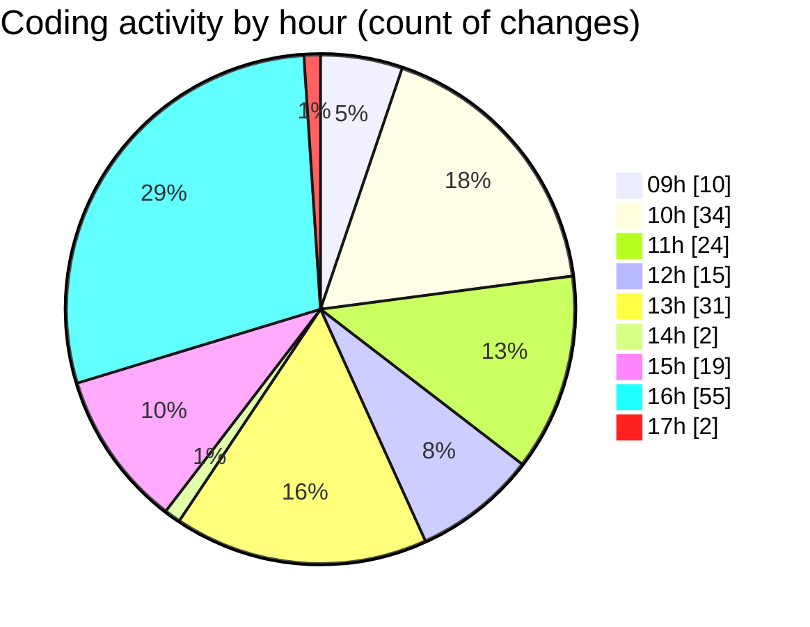

# cda - Activity Summary 

## Overall Statistics

| Stat                   | Value                                                             |
| ---------------------- | ----------------------------------------------------------------- |
| **Lines Added** (➕)   | 10183                                          |
| **Lines Removed** (➖) | 418                                        |
| **Net Change** (↕)    | 9765                |
| **Active Time** (⌚)   | 260 minutes |

## Modified Files
- **comments.ts** (+361, -24)
- **InitiativeDetails.tsx** (+1610, -64)
- **CommentItemList.tsx** (+927, -161)
- **CommentService.ts** (+369, -47)
- **TargetDetails.tsx** (+874, -23)
- **PoolDetails.tsx** (+1246, -23)
- **PoolPosition.tsx** (+1366, -43)
- **ReinvestmentDetail.tsx** (+1202, -28)
- **CommentService.test.ts** (+327, -1)
- **CostDetails.tsx** (+685, -1)
- **App.tsx** (+587, -1)
- **itKit-mutations.js** (+492, -2)
- **AddComment.scss** (+59, -0)
- **package.json** (+78, -0)

## Visualizations

### By File Type (Lines Changed)

### By Hour (Estimated Activity Count)

> **Last Updated:** 02/09/2025, 17:11:43