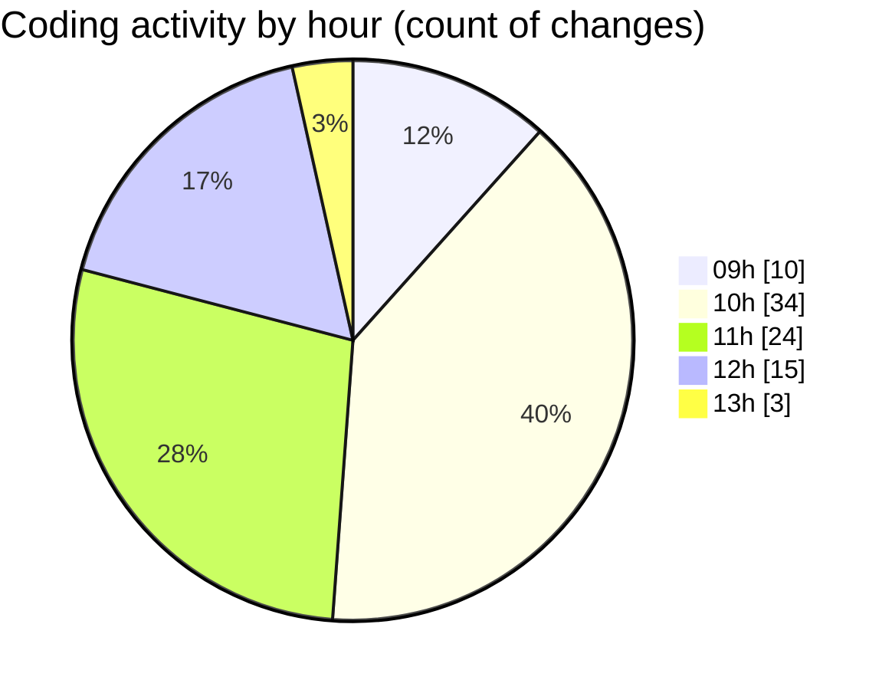

# cda - Activity Summary 

## Overall Statistics

| Stat                   | Value                                                             |
| ---------------------- | ----------------------------------------------------------------- |
| **Lines Added** (➕)   | 2368                                          |
| **Lines Removed** (➖) | 132                                        |
| **Net Change** (↕)    | 2236                |
| **Active Time** (⌚)   | 113 minutes |

## Modified Files
- **comments.ts** (+361, -24)
- **InitiativeDetails.tsx** (+806, -25)
- **CommentItemList.tsx** (+531, -29)
- **CommentService.ts** (+343, -34)
- **TargetDetails.tsx** (+0, -3)
- **PoolDetails.tsx** (+0, -3)
- **PoolPosition.tsx** (+0, -7)
- **ReinvestmentDetail.tsx** (+0, -6)
- **CommentService.test.ts** (+327, -1)

## Visualizations

### By File Type (Lines Changed)

### By Hour (Estimated Activity Count)

> **Last Updated:** 02/09/2025, 13:14:54