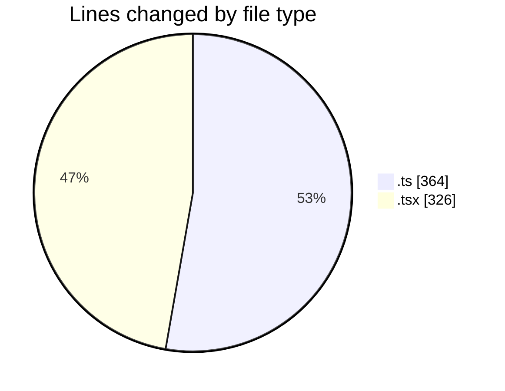
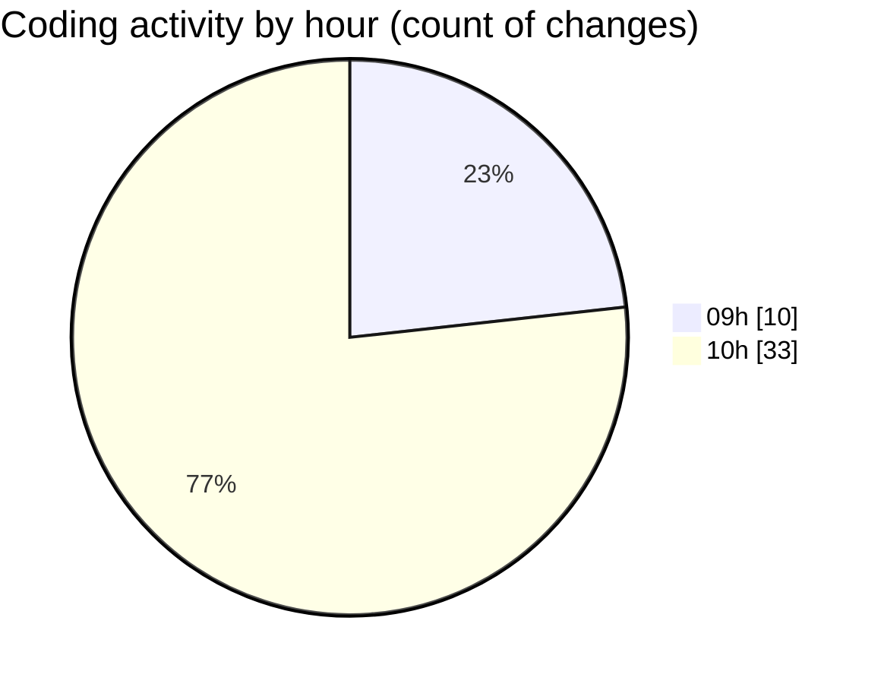

# cda - Activity Summary 

## Overall Statistics

| Stat                   | Value                                                             |
| ---------------------- | ----------------------------------------------------------------- |
| **Lines Added** (➕)   | 626                                          |
| **Lines Removed** (➖) | 64                                        |
| **Net Change** (↕)    | 562                |
| **Active Time** (⌚)   | 42 minutes |

## Modified Files
- **comments.ts** (+170, -0)
- **InitiativeDetails.tsx** (+19, -18)
- **CommentItemList.tsx** (+261, -9)
- **CommentService.ts** (+176, -18)
- **TargetDetails.tsx** (+0, -3)
- **PoolDetails.tsx** (+0, -3)
- **PoolPosition.tsx** (+0, -7)
- **ReinvestmentDetail.tsx** (+0, -6)

## Visualizations

### By File Type (Lines Changed)

### By Hour (Estimated Activity Count)

> **Last Updated:** 02/09/2025, 10:49:18