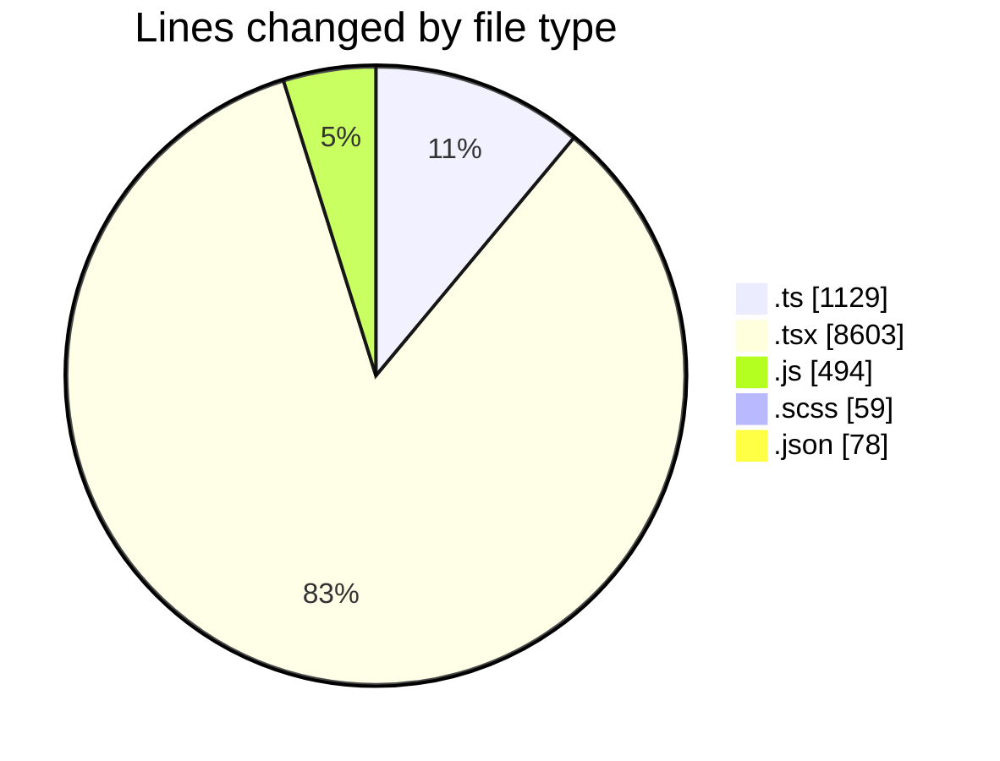
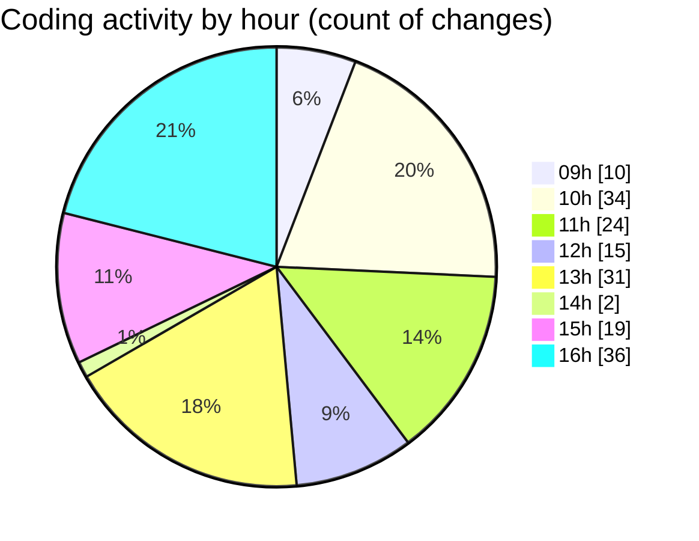

# cda - Activity Summary 

## Overall Statistics

| Stat                   | Value                                                             |
| ---------------------- | ----------------------------------------------------------------- |
| **Lines Added** (➕)   | 10074                                          |
| **Lines Removed** (➖) | 289                                        |
| **Net Change** (↕)    | 9785                |
| **Active Time** (⌚)   | 235 minutes |

## Modified Files
- **comments.ts** (+361, -24)
- **InitiativeDetails.tsx** (+1601, -46)
- **CommentItemList.tsx** (+851, -98)
- **CommentService.ts** (+369, -47)
- **TargetDetails.tsx** (+869, -13)
- **PoolDetails.tsx** (+1241, -13)
- **PoolPosition.tsx** (+1357, -25)
- **ReinvestmentDetail.tsx** (+1197, -18)
- **CommentService.test.ts** (+327, -1)
- **CostDetails.tsx** (+685, -1)
- **App.tsx** (+587, -1)
- **itKit-mutations.js** (+492, -2)
- **AddComment.scss** (+59, -0)
- **package.json** (+78, -0)

## Visualizations

### By File Type (Lines Changed)

### By Hour (Estimated Activity Count)

> **Last Updated:** 02/09/2025, 16:36:43