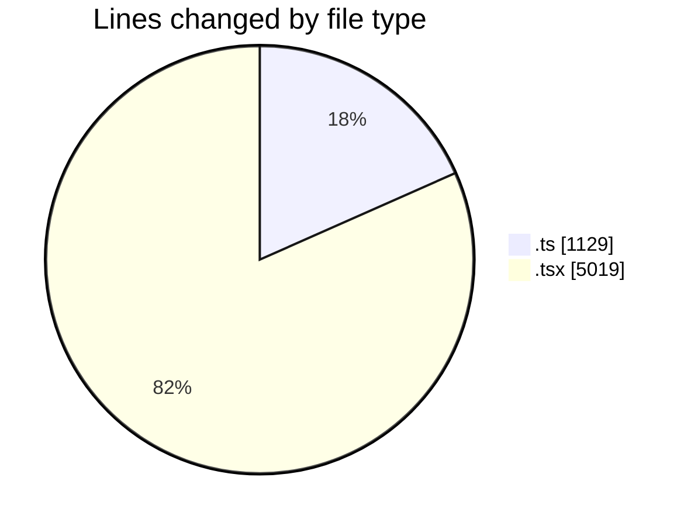
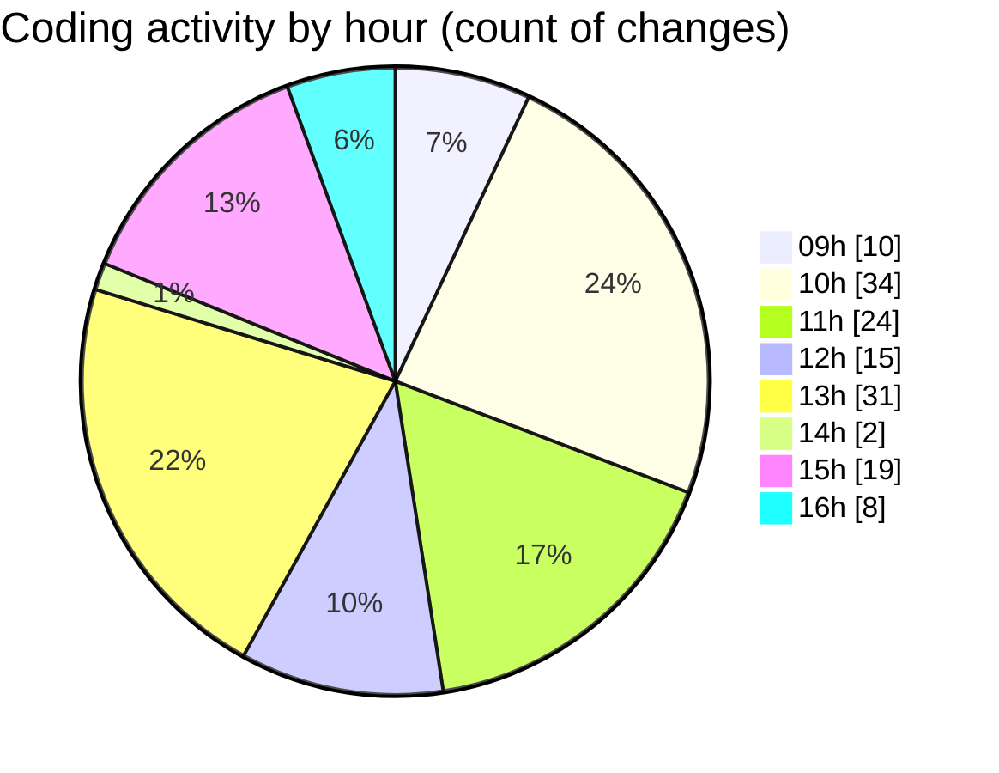

# cda - Activity Summary 

## Overall Statistics

| Stat                   | Value                                                             |
| ---------------------- | ----------------------------------------------------------------- |
| **Lines Added** (➕)   | 5936                                          |
| **Lines Removed** (➖) | 212                                        |
| **Net Change** (↕)    | 5724                |
| **Active Time** (⌚)   | 195 minutes |

## Modified Files
- **comments.ts** (+361, -24)
- **InitiativeDetails.tsx** (+811, -37)
- **CommentItemList.tsx** (+817, -56)
- **CommentService.ts** (+369, -47)
- **TargetDetails.tsx** (+432, -8)
- **PoolDetails.tsx** (+618, -8)
- **PoolPosition.tsx** (+674, -16)
- **ReinvestmentDetail.tsx** (+597, -13)
- **CommentService.test.ts** (+327, -1)
- **CostDetails.tsx** (+343, -1)
- **App.tsx** (+587, -1)

## Visualizations

### By File Type (Lines Changed)

### By Hour (Estimated Activity Count)

> **Last Updated:** 02/09/2025, 16:06:43