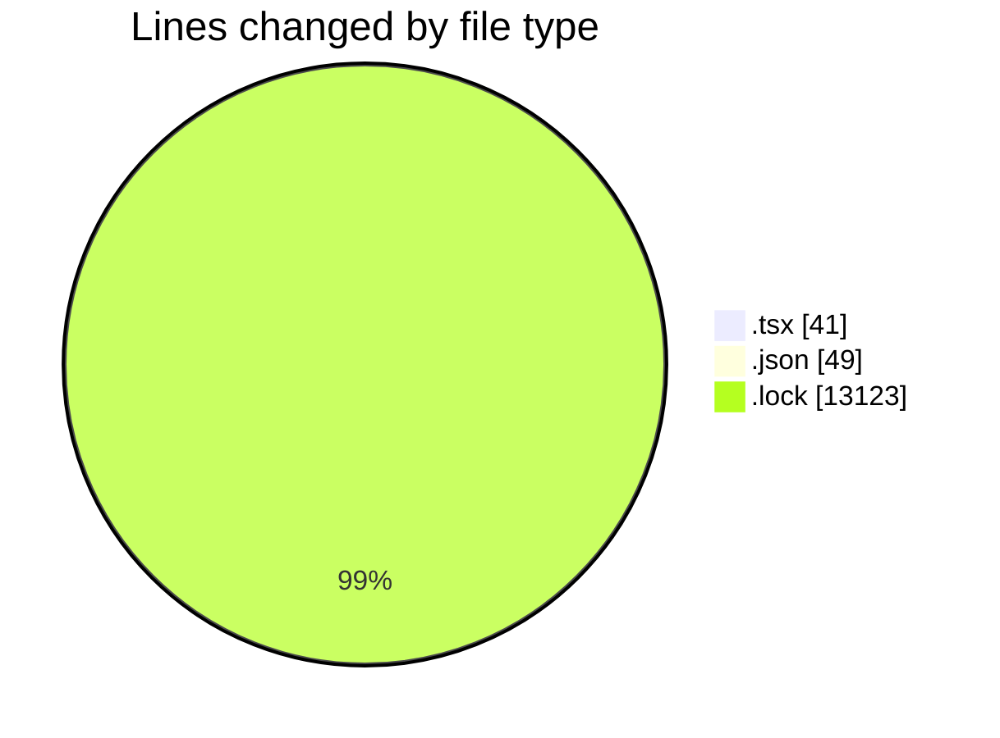
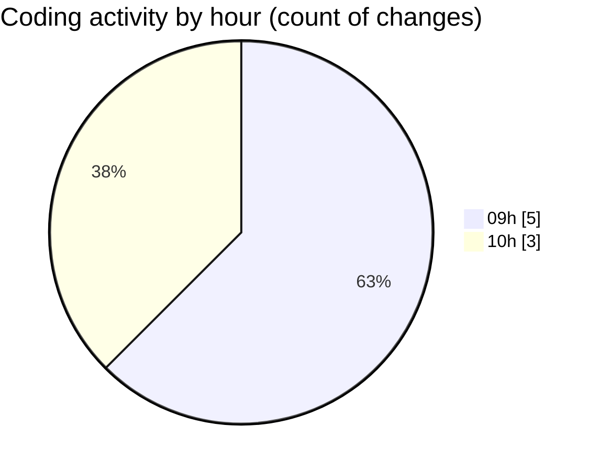

# cda - Activity Summary 

## Overall Statistics

| Stat                   | Value                                                             |
| ---------------------- | ----------------------------------------------------------------- |
| **Lines Added** (➕)   | 13185                                          |
| **Lines Removed** (➖) | 28                                        |
| **Net Change** (↕)    | 13157                |
| **Active Time** (⌚)   | 4 minutes |

## Modified Files
- **InitiativeDetails.tsx** (+0, -9)
- **PoolDetails.tsx** (+0, -5)
- **PoolPosition.tsx** (+0, -9)
- **TargetDetails.tsx** (+0, -5)
- **CommentItemList.tsx** (+13, -0)
- **settings.json** (+49, -0)
- **yarn.lock** (+13123, -0)

## Visualizations

### By File Type (Lines Changed)

### By Hour (Estimated Activity Count)

> **Last Updated:** 03/09/2025, 10:21:14