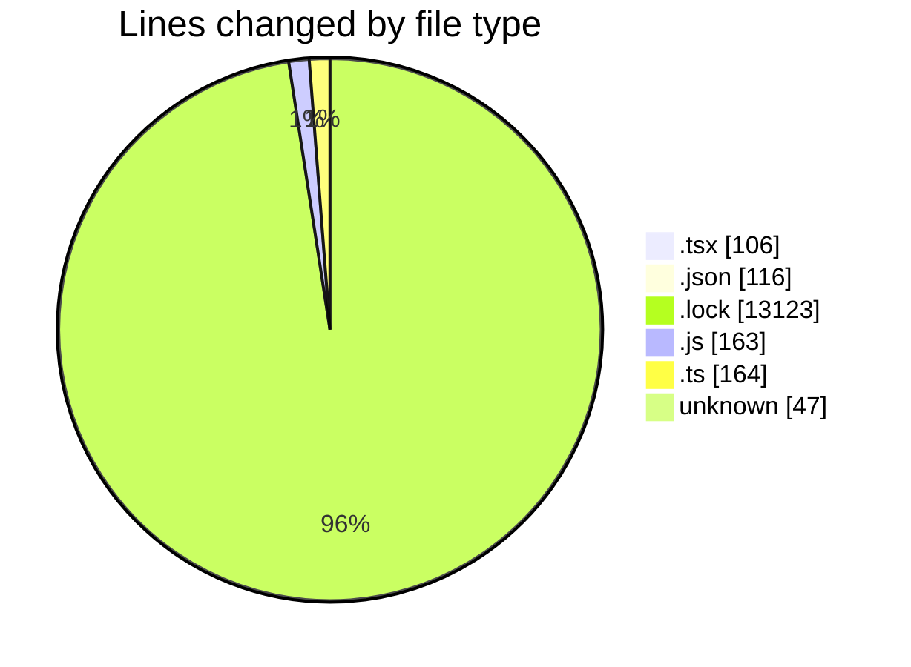
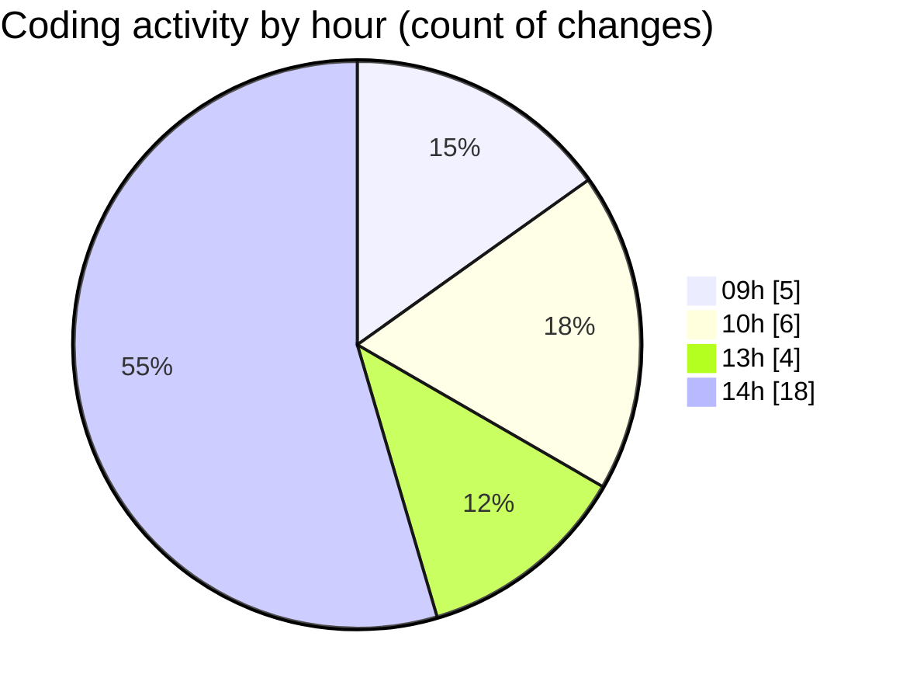

# cda - Activity Summary 

## Overall Statistics

| Stat                   | Value                                                             |
| ---------------------- | ----------------------------------------------------------------- |
| **Lines Added** (➕)   | 13662                                          |
| **Lines Removed** (➖) | 57                                        |
| **Net Change** (↕)    | 13605                |
| **Active Time** (⌚)   | 36 minutes |

## Modified Files
- **InitiativeDetails.tsx** (+0, -9)
- **PoolDetails.tsx** (+0, -5)
- **PoolPosition.tsx** (+0, -9)
- **TargetDetails.tsx** (+0, -5)
- **CommentItemList.tsx** (+13, -0)
- **settings.json** (+104, -12)
- **yarn.lock** (+13123, -0)
- **duty-request.js** (+98, -0)
- **CommentService.ts** (+164, -0)
- **.env** (+47, -0)
- **index.tsx** (+61, -4)
- **20250903131023-alter-calendar-event-person-pivot-table.js** (+34, -8)
- **20250903131454-alter-calendar-event-external-pivot-table.js** (+18, -5)

## Visualizations

### By File Type (Lines Changed)

### By Hour (Estimated Activity Count)

> **Last Updated:** 03/09/2025, 14:39:46