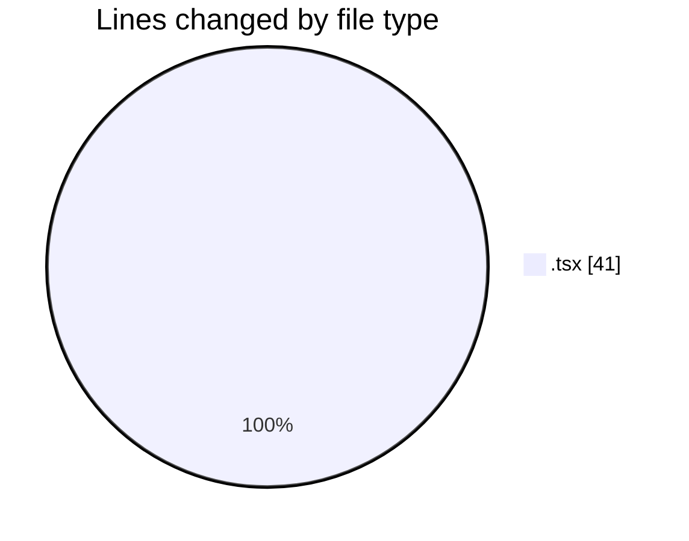
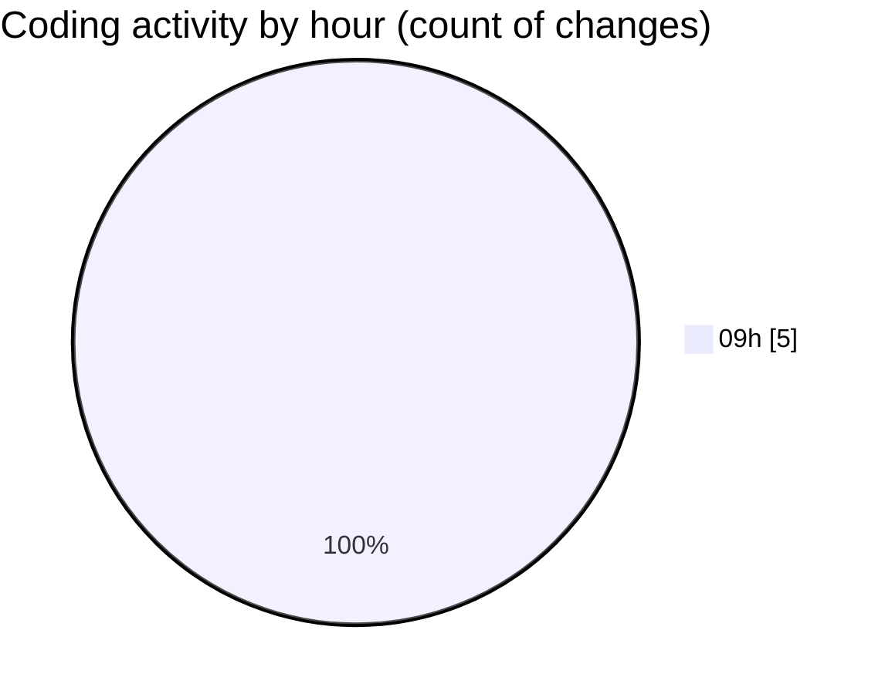

# cda - Activity Summary 

## Overall Statistics

| Stat                   | Value                                                             |
| ---------------------- | ----------------------------------------------------------------- |
| **Lines Added** (➕)   | 13                                          |
| **Lines Removed** (➖) | 28                                        |
| **Net Change** (↕)    | -15                |
| **Active Time** (⌚)   | 3 minutes |

## Modified Files
- **InitiativeDetails.tsx** (+0, -9)
- **PoolDetails.tsx** (+0, -5)
- **PoolPosition.tsx** (+0, -9)
- **TargetDetails.tsx** (+0, -5)
- **CommentItemList.tsx** (+13, -0)

## Visualizations

### By File Type (Lines Changed)

### By Hour (Estimated Activity Count)

> **Last Updated:** 03/09/2025, 09:44:23