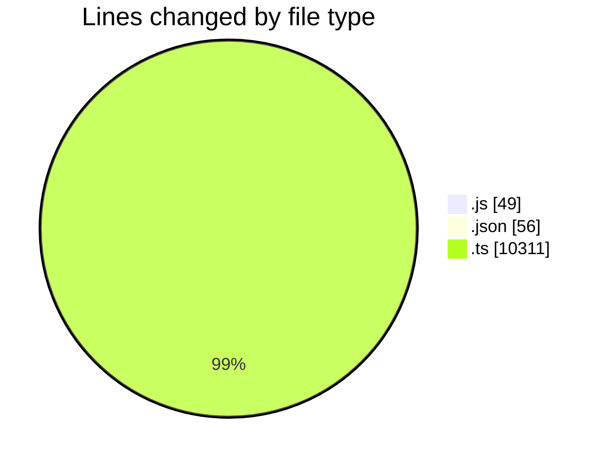
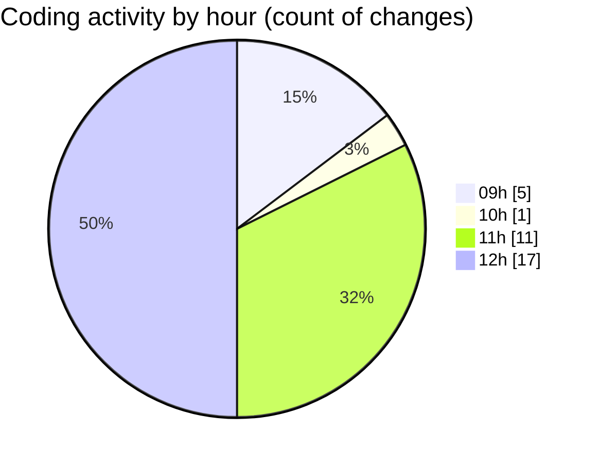

# cda - Activity Summary 

## Overall Statistics

| Stat                   | Value                                                             |
| ---------------------- | ----------------------------------------------------------------- |
| **Lines Added** (➕)   | 10327                                          |
| **Lines Removed** (➖) | 89                                        |
| **Net Change** (↕)    | 10238                |
| **Active Time** (⌚)   | 55 minutes |

## Modified Files
- **20250903140032-alter-calendar-event-external-attendees-view.js** (+22, -0)
- **settings.json** (+50, -6)
- **20250903134609-alter-calendar-event-internal-attendees-view.js** (+27, -0)
- **calendar.ts** (+1115, -83)
- **resolvers-types.ts** (+9113, -0)

## Visualizations

### By File Type (Lines Changed)

### By Hour (Estimated Activity Count)

> **Last Updated:** 04/09/2025, 13:00:35