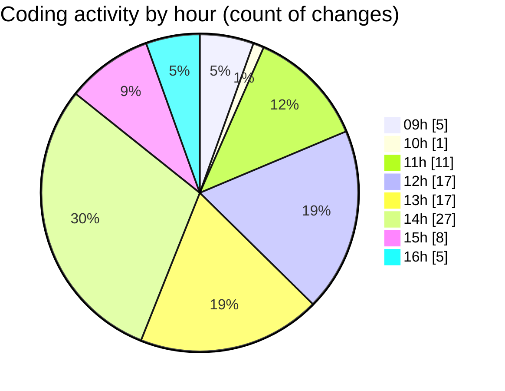

# cda - Activity Summary 

## Overall Statistics

| Stat                   | Value                                                             |
| ---------------------- | ----------------------------------------------------------------- |
| **Lines Added** (➕)   | 12085                                          |
| **Lines Removed** (➖) | 1361                                        |
| **Net Change** (↕)    | 10724                |
| **Active Time** (⌚)   | 152 minutes |

## Modified Files
- **20250903140032-alter-calendar-event-external-attendees-view.js** (+22, -0)
- **settings.json** (+50, -6)
- **20250903134609-alter-calendar-event-internal-attendees-view.js** (+27, -0)
- **calendar.ts** (+2246, -1334)
- **resolvers-types.ts** (+9113, -0)
- **venueTypeFromFlags.ts** (+40, -0)
- **events.ts** (+101, -7)
- **events.test.ts** (+92, -0)
- **index.js** (+96, -6)
- **events.ts** (+106, -8)
- **permissions.ts** (+192, -0)

## Visualizations

### By File Type (Lines Changed)

### By Hour (Estimated Activity Count)

> **Last Updated:** 04/09/2025, 16:15:35