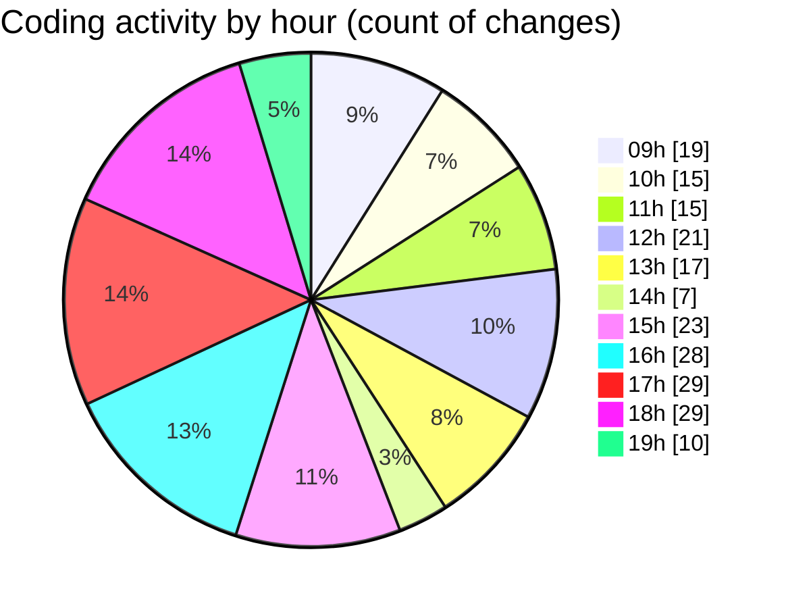

# cda - Activity Summary 

## Overall Statistics

| Stat                   | Value                                                             |
| ---------------------- | ----------------------------------------------------------------- |
| **Lines Added** (➕)   | 14476                                          |
| **Lines Removed** (➖) | 1108                                        |
| **Net Change** (↕)    | 13368                |
| **Active Time** (⌚)   | 329 minutes |

## Modified Files
- **calendar.ts** (+3371, -527)
- **calendar.js** (+627, -1)
- **events.ts** (+392, -222)
- **resolvers-types.ts** (+9121, -0)
- **eventTypeFromFlags.ts** (+375, -155)
- **.env** (+94, -0)
- **calendarEvents.ts** (+43, -0)
- **calendarEvent.ts** (+263, -103)
- **events.test.ts** (+190, -100)

## Visualizations

### By File Type (Lines Changed)

### By Hour (Estimated Activity Count)

> **Last Updated:** 05/09/2025, 19:20:29