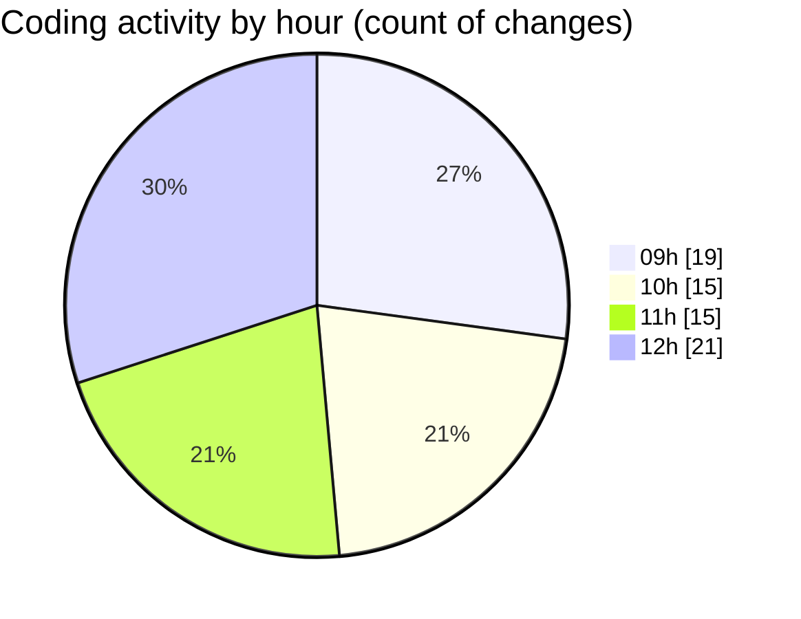

# cda - Activity Summary 

## Overall Statistics

| Stat                   | Value                                                             |
| ---------------------- | ----------------------------------------------------------------- |
| **Lines Added** (➕)   | 12458                                          |
| **Lines Removed** (➖) | 483                                        |
| **Net Change** (↕)    | 11975                |
| **Active Time** (⌚)   | 99 minutes |

## Modified Files
- **calendar.ts** (+2368, -430)
- **calendar.js** (+627, -1)
- **events.ts** (+208, -52)
- **resolvers-types.ts** (+9121, -0)
- **eventTypeFromFlags.ts** (+87, -0)
- **.env** (+47, -0)

## Visualizations

### By File Type (Lines Changed)

### By Hour (Estimated Activity Count)

> **Last Updated:** 05/09/2025, 13:01:29