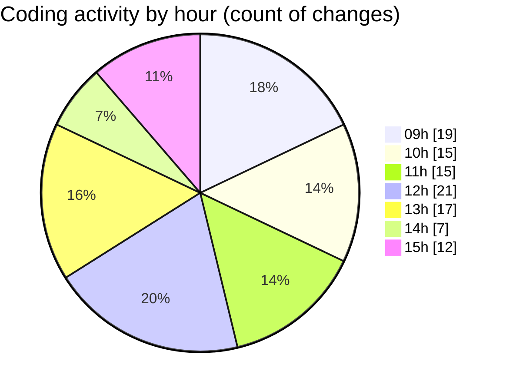

# cda - Activity Summary 

## Overall Statistics

| Stat                   | Value                                                             |
| ---------------------- | ----------------------------------------------------------------- |
| **Lines Added** (➕)   | 12637                                          |
| **Lines Removed** (➖) | 582                                        |
| **Net Change** (↕)    | 12055                |
| **Active Time** (⌚)   | 164 minutes |

## Modified Files
- **calendar.ts** (+2378, -437)
- **calendar.js** (+627, -1)
- **events.ts** (+225, -56)
- **resolvers-types.ts** (+9121, -0)
- **eventTypeFromFlags.ts** (+239, -88)
- **.env** (+47, -0)

## Visualizations

### By File Type (Lines Changed)

### By Hour (Estimated Activity Count)

> **Last Updated:** 05/09/2025, 15:31:29