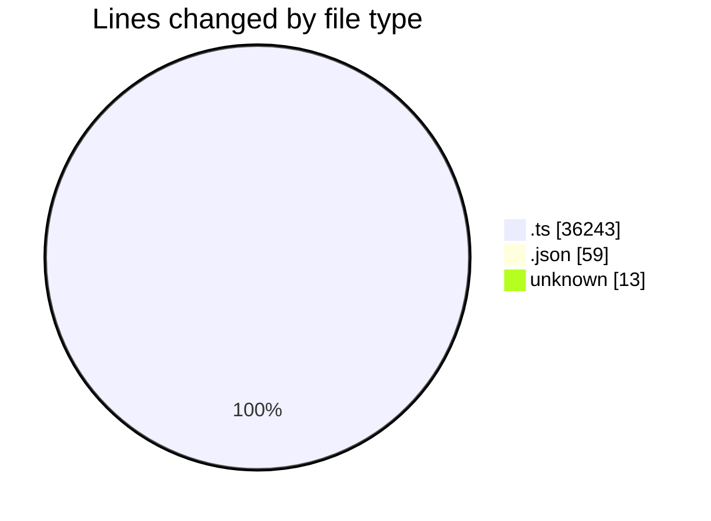
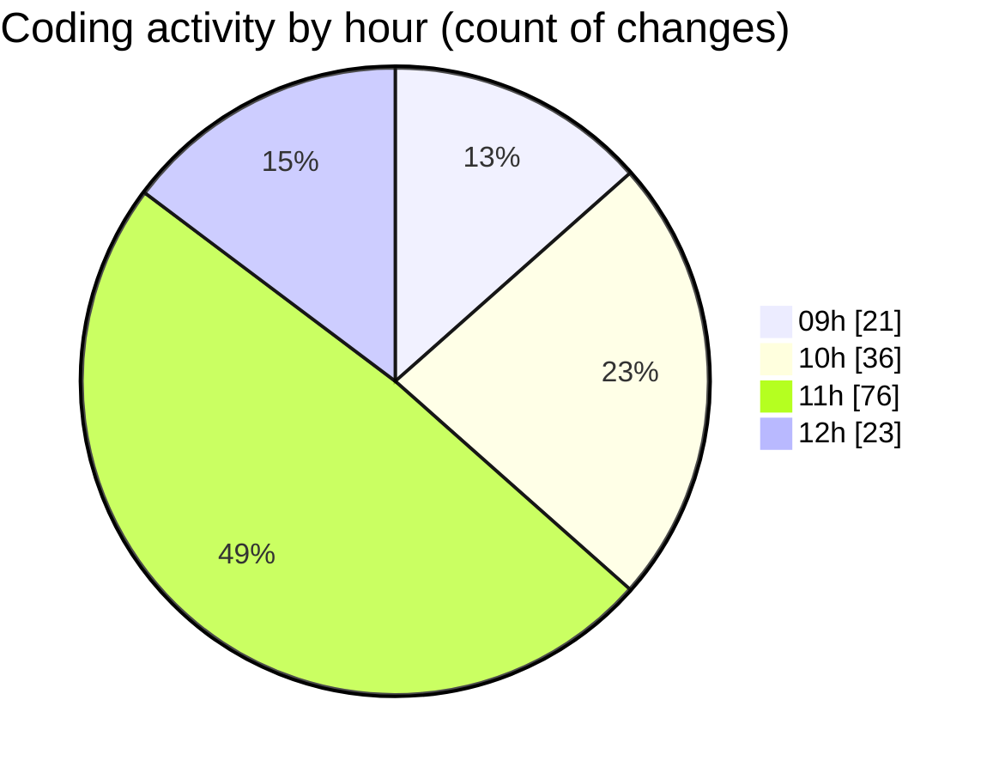

# cda - Activity Summary 

## Overall Statistics

| Stat                   | Value                                                             |
| ---------------------- | ----------------------------------------------------------------- |
| **Lines Added** (➕)   | 35830                                          |
| **Lines Removed** (➖) | 485                                        |
| **Net Change** (↕)    | 35345                |
| **Active Time** (⌚)   | 194 minutes |

## Modified Files
- **index.ts** (+1058, -24)
- **tables.ts** (+5788, -28)
- **clear_view_views.ts** (+3615, -29)
- **desks.ts** (+749, -0)
- **HelperTextService.ts** (+93, -0)
- **it-kit.ts** (+101, -0)
- **yesalert.ts** (+440, -0)
- **app.ts** (+644, -0)
- **buildings.ts** (+317, -29)
- **calendar.ts** (+1042, -95)
- **everywhere.ts** (+352, -0)
- **DivisionService.ts** (+80, -0)
- **AllocateFiltering.ts** (+68, -3)
- **RotaPattern.ts** (+87, -0)
- **checkUserPermissions.ts** (+61, -0)
- **ClearViewUser.ts** (+153, -0)
- **CostService.ts** (+372, -0)
- **InitiativeGroupService.ts** (+245, -0)
- **LoggingService.ts** (+685, -0)
- **NotificationService.ts** (+1069, -0)
- **PermissionService.ts** (+666, -0)
- **PoolService.ts** (+306, -0)
- **ProposalService.ts** (+340, -0)
- **ReinvestmentForecastService.ts** (+271, -0)
- **ReinvestmentGroupService.ts** (+236, -0)
- **ReinvestmentService.ts** (+322, -0)
- **SnapshotService.ts** (+86, -0)
- **StrategyService.ts** (+183, -0)
- **SubstantivePositionSearchService.ts** (+140, -0)
- **TargetService.ts** (+402, -0)
- **TargetValueService.ts** (+82, -1)
- **YearService.ts** (+47, -0)
- **everywhere.ts** (+115, -0)
- **DatasetService.ts** (+280, -0)
- **AnswerService.ts** (+163, -0)
- **FormSchemaService.ts** (+91, -0)
- **FormService.ts** (+361, -0)
- **InfosecForms.ts** (+50, -0)
- **PartService.ts** (+164, -0)
- **PermissionService.ts** (+83, -0)
- **iPagesTagViewer.ts** (+26, -3)
- **TagService.ts** (+120, -0)
- **index.ts** (+28, -0)
- **settings.json** (+53, -6)
- **.prettierrc** (+13, -0)
- **UserService.ts** (+140, -0)
- **peopleKit.ts** (+41, -0)
- **SkillTagFavourites.ts** (+44, -0)
- **SkillTagPermissions.ts** (+12, -0)
- **CategoryService.ts** (+84, -1)
- **MaximService.ts** (+188, -1)
- **PermissionsService.ts** (+131, -1)
- **ProjectService.ts** (+111, -1)
- **SystemService.ts** (+128, -1)
- **TeamCharter.ts** (+49, -7)
- **GroupService.ts** (+58, -0)
- **SystemService.ts** (+122, -1)
- **YesAlertService.ts** (+30, -6)
- **businesses.ts** (+54, -0)
- **costs.ts** (+109, -0)
- **events.ts** (+69, -0)
- **initiatives.ts** (+391, -0)
- **notifications.ts** (+59, -0)
- **proposal-target.ts** (+218, -0)
- **reports.ts** (+31, -0)
- **userPermissions.ts** (+153, -0)
- **activityFeed.ts** (+57, -0)
- **working-status.ts** (+37, -0)
- **form-schemas.ts** (+716, -0)
- **forms.ts** (+299, -0)
- **tags.ts** (+25, -0)
- **users.ts** (+26, -0)
- **skill-tags.ts** (+129, -0)
- **maxims.ts** (+68, -0)
- **groupTransformer.ts** (+51, -0)
- **MockAnswerService.ts** (+306, -1)
- **integration-tests.test.ts** (+144, -4)
- **desk-mutations.ts** (+807, -65)
- **desks-queries.ts** (+171, -3)
- **form-mutations.ts** (+2110, -12)
- **form-queries.ts** (+1313, -0)
- **form-schemas.ts** (+1500, -0)
- **ipages-tag-viewer-mutations.ts** (+298, -14)
- **ipages-tag-viewer-queries.ts** (+721, -31)
- **AllocateFiltering.test.ts** (+192, -100)
- **RotaPattern.test.ts** (+82, -4)
- **checkUserPermissions.test.ts** (+156, -14)
- **DatasetService.test.ts** (+755, -0)
- **GroupService.test.ts** (+113, -0)
- **SystemService.test.ts** (+76, -0)
- **activityFeed.test.ts** (+110, -0)
- **working-status.test.ts** (+114, -0)
- **form-schemas.test.ts** (+802, -0)
- **forms.test.ts** (+350, -0)
- **skill-tags.test.ts** (+433, -0)

## Visualizations

### By File Type (Lines Changed)

### By Hour (Estimated Activity Count)

> **Last Updated:** 09/09/2025, 12:05:33