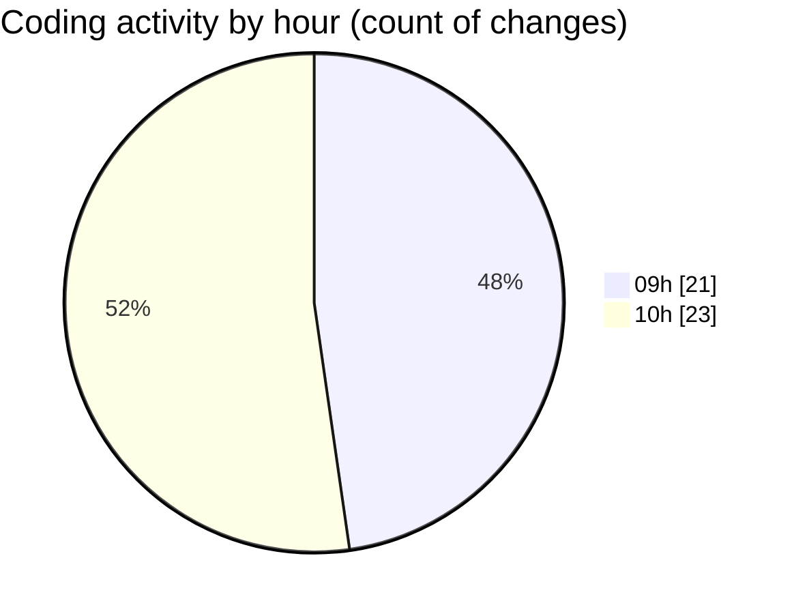

# cda - Activity Summary 

## Overall Statistics

| Stat                   | Value                                                             |
| ---------------------- | ----------------------------------------------------------------- |
| **Lines Added** (➕)   | 15252                                          |
| **Lines Removed** (➖) | 81                                        |
| **Net Change** (↕)    | 15171                |
| **Active Time** (⌚)   | 55 minutes |

## Modified Files
- **index.ts** (+1058, -24)
- **tables.ts** (+5788, -28)
- **clear_view_views.ts** (+3615, -29)
- **desks.ts** (+749, -0)
- **HelperTextService.ts** (+93, -0)
- **it-kit.ts** (+101, -0)
- **yesalert.ts** (+440, -0)
- **app.ts** (+644, -0)
- **buildings.ts** (+304, -0)
- **calendar.ts** (+1042, -0)
- **everywhere.ts** (+352, -0)
- **DivisionService.ts** (+80, -0)
- **AllocateFiltering.ts** (+68, -0)
- **RotaPattern.ts** (+87, -0)
- **checkUserPermissions.ts** (+61, -0)
- **ClearViewUser.ts** (+153, -0)
- **CostService.ts** (+372, -0)
- **InitiativeGroupService.ts** (+245, -0)

## Visualizations

### By File Type (Lines Changed)

### By Hour (Estimated Activity Count)

> **Last Updated:** 09/09/2025, 10:55:33