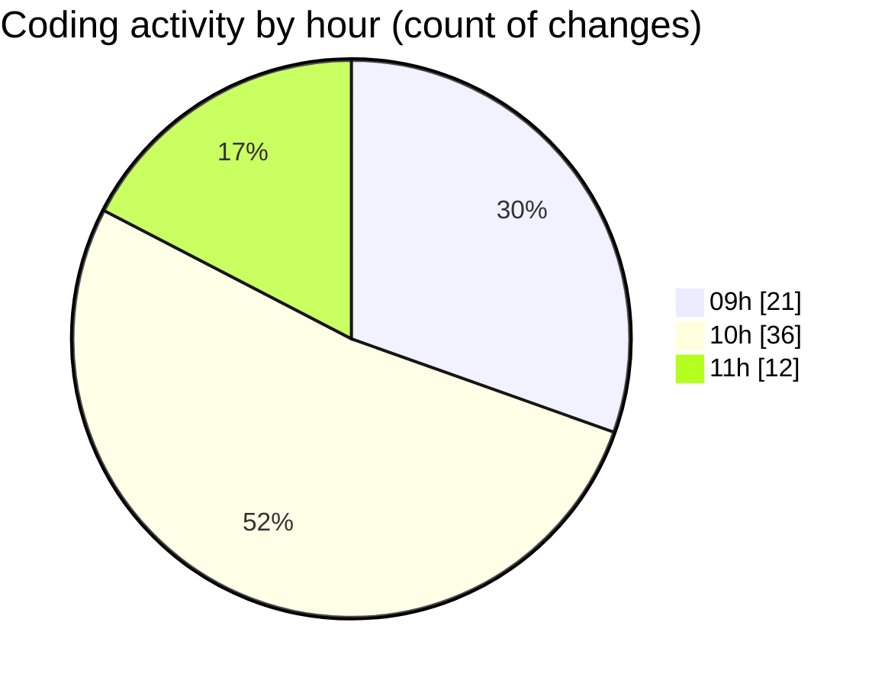

# cda - Activity Summary 

## Overall Statistics

| Stat                   | Value                                                             |
| ---------------------- | ----------------------------------------------------------------- |
| **Lines Added** (➕)   | 21420                                          |
| **Lines Removed** (➖) | 82                                        |
| **Net Change** (↕)    | 21338                |
| **Active Time** (⌚)   | 86 minutes |

## Modified Files
- **index.ts** (+1058, -24)
- **tables.ts** (+5788, -28)
- **clear_view_views.ts** (+3615, -29)
- **desks.ts** (+749, -0)
- **HelperTextService.ts** (+93, -0)
- **it-kit.ts** (+101, -0)
- **yesalert.ts** (+440, -0)
- **app.ts** (+644, -0)
- **buildings.ts** (+304, -0)
- **calendar.ts** (+1042, -0)
- **everywhere.ts** (+352, -0)
- **DivisionService.ts** (+80, -0)
- **AllocateFiltering.ts** (+68, -0)
- **RotaPattern.ts** (+87, -0)
- **checkUserPermissions.ts** (+61, -0)
- **ClearViewUser.ts** (+153, -0)
- **CostService.ts** (+372, -0)
- **InitiativeGroupService.ts** (+245, -0)
- **LoggingService.ts** (+685, -0)
- **NotificationService.ts** (+1069, -0)
- **PermissionService.ts** (+666, -0)
- **PoolService.ts** (+306, -0)
- **ProposalService.ts** (+340, -0)
- **ReinvestmentForecastService.ts** (+271, -0)
- **ReinvestmentGroupService.ts** (+236, -0)
- **ReinvestmentService.ts** (+322, -0)
- **SnapshotService.ts** (+86, -0)
- **StrategyService.ts** (+183, -0)
- **SubstantivePositionSearchService.ts** (+140, -0)
- **TargetService.ts** (+402, -0)
- **TargetValueService.ts** (+82, -1)
- **YearService.ts** (+47, -0)
- **everywhere.ts** (+115, -0)
- **DatasetService.ts** (+280, -0)
- **AnswerService.ts** (+163, -0)
- **FormSchemaService.ts** (+91, -0)
- **FormService.ts** (+361, -0)
- **InfosecForms.ts** (+50, -0)
- **PartService.ts** (+164, -0)
- **PermissionService.ts** (+83, -0)
- **iPagesTagViewer.ts** (+26, -0)

## Visualizations

### By File Type (Lines Changed)

### By Hour (Estimated Activity Count)

> **Last Updated:** 09/09/2025, 11:10:33