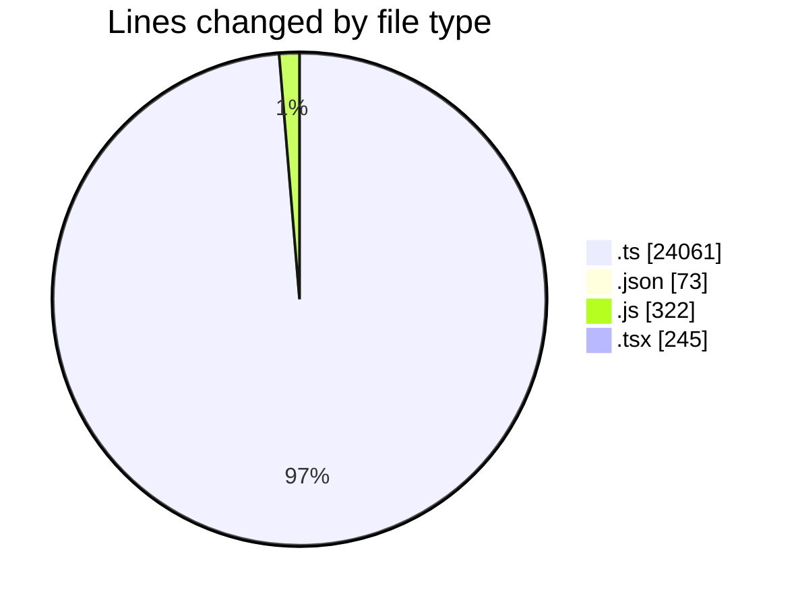
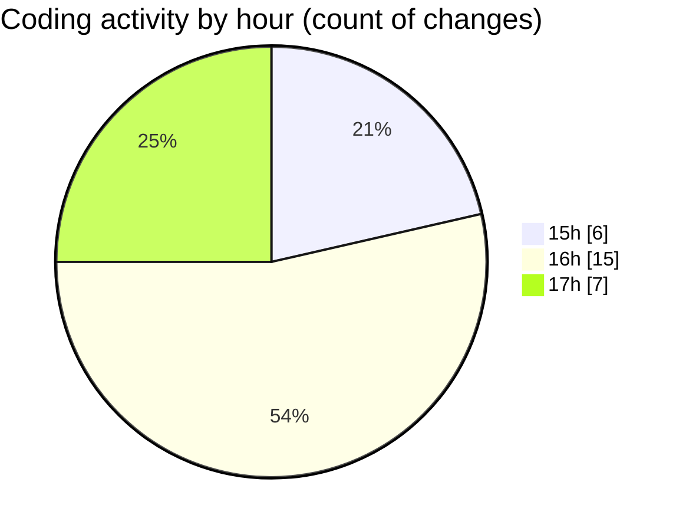

# cda - Activity Summary 

## Overall Statistics

| Stat                   | Value                                                             |
| ---------------------- | ----------------------------------------------------------------- |
| **Lines Added** (➕)   | 24547                                          |
| **Lines Removed** (➖) | 154                                        |
| **Net Change** (↕)    | 24393                |
| **Active Time** (⌚)   | 21 minutes |

## Modified Files
- **PoolPositionService.ts** (+686, -57)
- **DivisionService.ts** (+238, -0)
- **package.json** (+25, -0)
- **calendar.js** (+316, -6)
- **resolvers-types.ts** (+9156, -0)
- **clear_view_controlled_tables.ts** (+615, -0)
- **clear_view_tables.ts** (+1134, -0)
- **clear_view_views.ts** (+3587, -0)
- **tables.ts** (+5760, -0)
- **calendar-queries.ts** (+1500, -89)
- **settings.json** (+48, -0)
- **index.ts** (+197, -0)
- **calendar.ts** (+1042, -0)
- **Attendees.tsx** (+243, -2)

## Visualizations

### By File Type (Lines Changed)

### By Hour (Estimated Activity Count)

> **Last Updated:** 10/09/2025, 17:23:21