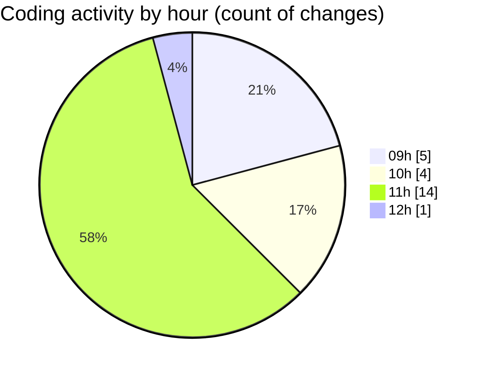

# cda - Activity Summary 

## Overall Statistics

| Stat                   | Value                                                             |
| ---------------------- | ----------------------------------------------------------------- |
| **Lines Added** (➕)   | 1039                                          |
| **Lines Removed** (➖) | 171                                        |
| **Net Change** (↕)    | 868                |
| **Active Time** (⌚)   | 28 minutes |

## Modified Files
- **index.ts** (+0, -4)
- **Attendees.tsx** (+0, -4)
- **tables.ts** (+0, -4)
- **calendar.ts** (+931, -128)
- **calendar-queries.ts** (+0, -31)
- **.env** (+47, -0)
- **index.tsx** (+61, -0)

## Visualizations

### By File Type (Lines Changed)

### By Hour (Estimated Activity Count)

> **Last Updated:** 11/09/2025, 12:01:08