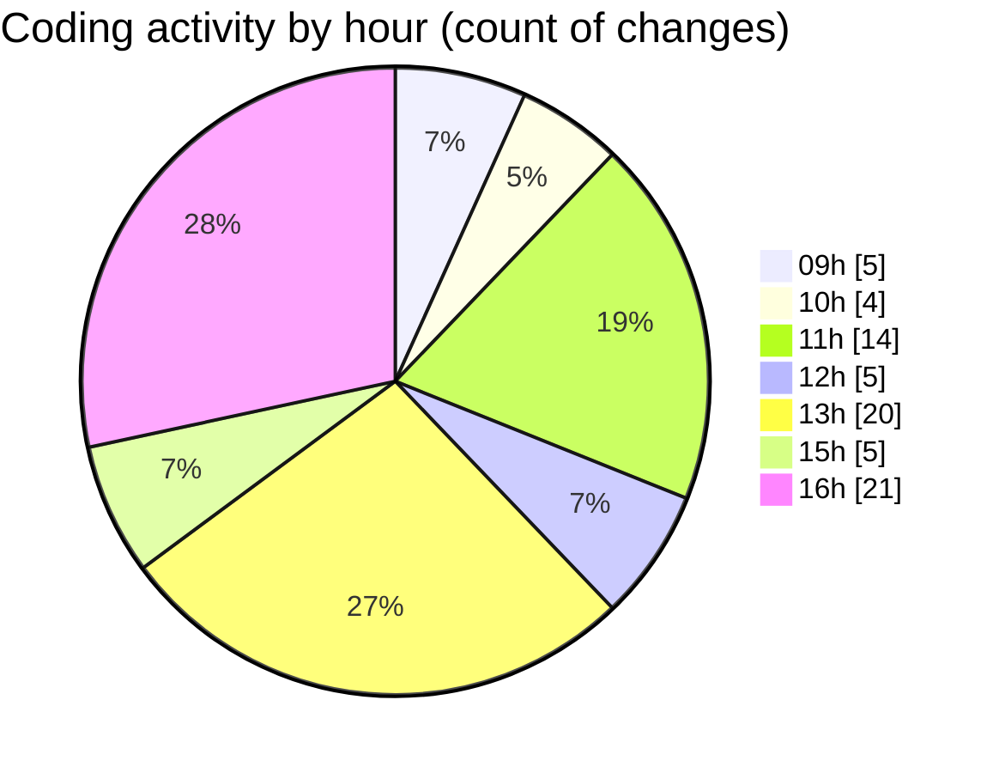

# cda - Activity Summary 

## Overall Statistics

| Stat                   | Value                                                             |
| ---------------------- | ----------------------------------------------------------------- |
| **Lines Added** (➕)   | 19327                                          |
| **Lines Removed** (➖) | 433                                        |
| **Net Change** (↕)    | 18894                |
| **Active Time** (⌚)   | 104 minutes |

## Modified Files
- **index.ts** (+0, -4)
- **Attendees.tsx** (+0, -4)
- **tables.ts** (+5752, -8)
- **calendar.ts** (+1916, -230)
- **calendar-queries.ts** (+1500, -62)
- **.env** (+94, -0)
- **index.tsx** (+61, -4)
- **eventTypeFromFlags.ts** (+190, -0)
- **emails.ts** (+414, -0)
- **calendarEvent.ts** (+244, -86)
- **resolvers-types.ts** (+9156, -35)

## Visualizations

### By File Type (Lines Changed)

### By Hour (Estimated Activity Count)

> **Last Updated:** 11/09/2025, 16:58:45