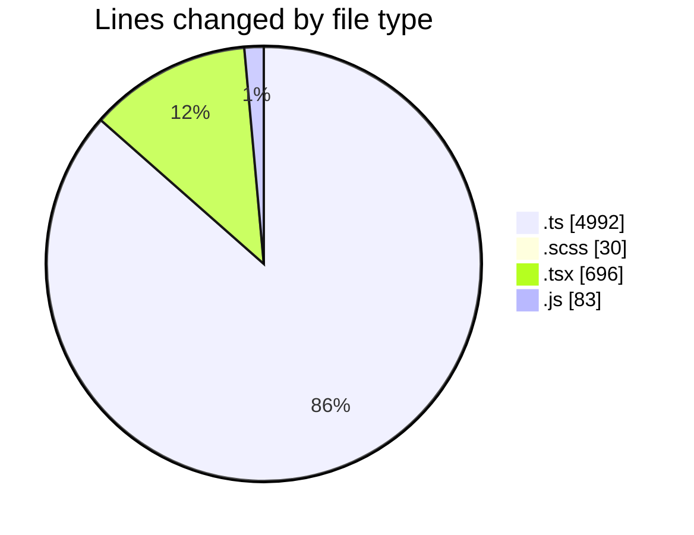
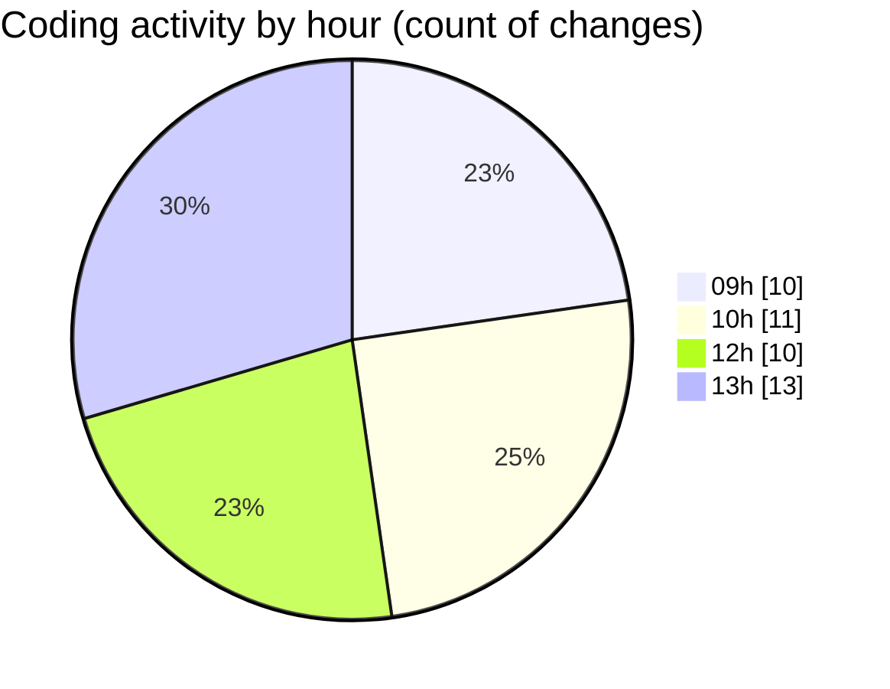

# cda - Activity Summary 

## Overall Statistics

| Stat                   | Value                                                             |
| ---------------------- | ----------------------------------------------------------------- |
| **Lines Added** (➕)   | 5653                                          |
| **Lines Removed** (➖) | 148                                        |
| **Net Change** (↕)    | 5505                |
| **Active Time** (⌚)   | 67 minutes |

## Modified Files
- **calendar.ts** (+14, -17)
- **eventTypeFromFlags.ts** (+101, -46)
- **events.ts** (+112, -2)
- **calendar-queries.ts** (+1469, -0)
- **calendar-mutations.ts** (+3148, -0)
- **WeekViewHeader.scss** (+30, -0)
- **App.tsx** (+237, -0)
- **WeekViewHeader.tsx** (+99, -0)
- **ScrollableDatepicker.js** (+83, -0)
- **ScrollableDatepicker.ts** (+83, -0)
- **ScrollableDatepicker.tsx** (+277, -83)

## Visualizations

### By File Type (Lines Changed)

### By Hour (Estimated Activity Count)

> **Last Updated:** 12/09/2025, 13:13:31