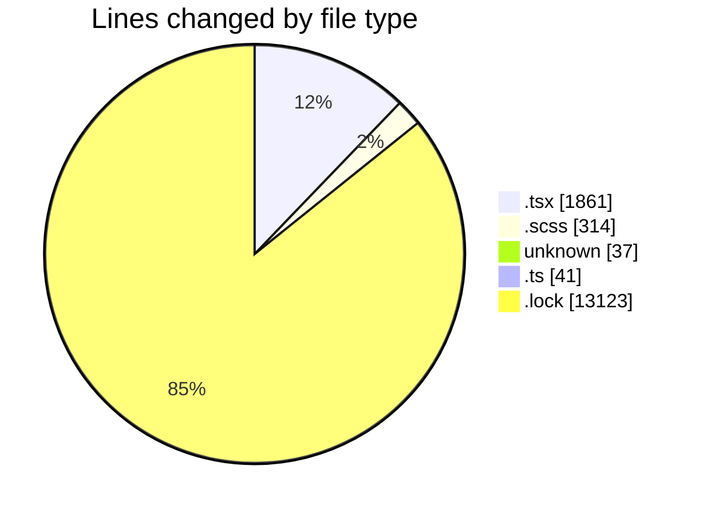
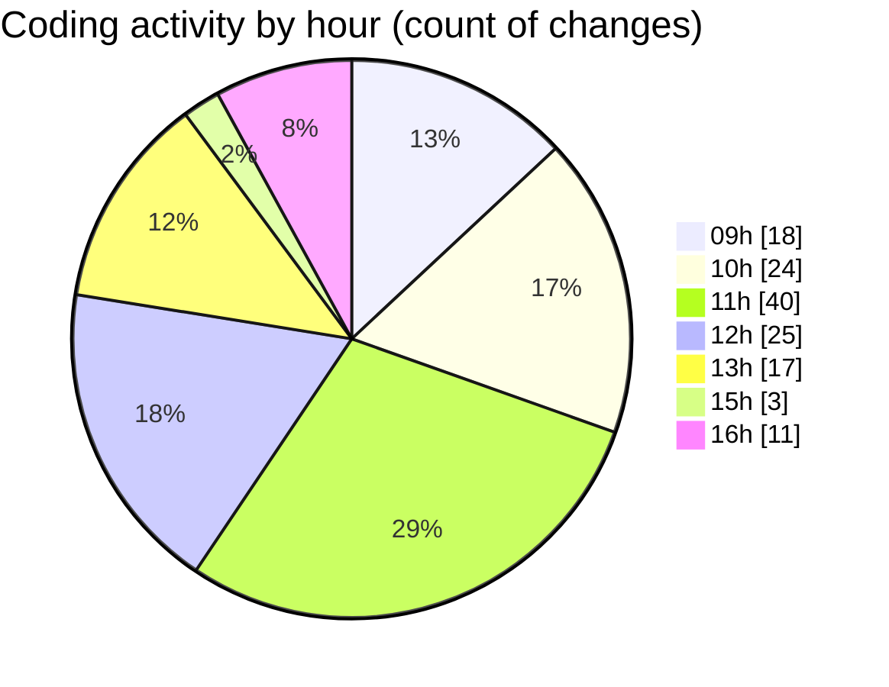

# cda - Activity Summary 

## Overall Statistics

| Stat                   | Value                                                             |
| ---------------------- | ----------------------------------------------------------------- |
| **Lines Added** (➕)   | 14930                                          |
| **Lines Removed** (➖) | 446                                        |
| **Net Change** (↕)    | 14484                |
| **Active Time** (⌚)   | 229 minutes |

## Modified Files
- **ScrollableDatepicker.tsx** (+86, -81)
- **Home.tsx** (+546, -315)
- **ScrollableDatepicker.scss** (+305, -9)
- **centerOnResize** (+37, -0)
- **centerOnResize.ts** (+39, -0)
- **Home.test.tsx** (+545, -34)
- **ScrollableDatepicker.test.tsx** (+1, -0)
- **config.ts** (+0, -2)
- **index.tsx** (+61, -4)
- **yarn.lock** (+13123, -0)
- **Footer.tsx** (+187, -1)

## Visualizations

### By File Type (Lines Changed)

### By Hour (Estimated Activity Count)

> **Last Updated:** 16/09/2025, 16:17:57